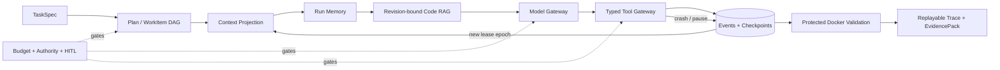

# Horizon — Recoverable Coding Agent Harness

[](https://github.com/caoshangrui-spec/horizon-coding-harness/actions/workflows/ci.yml)

[](https://github.com/caoshangrui-spec/horizon-coding-harness/releases/tag/v0.1.0)


Horizon 是一个面向长程软件工程任务的**可恢复执行控制层**。它让 Coding Agent 在模型调用、
工具执行、进程重启和验证之间保留可审计状态，并以预算、权限和证据门禁约束每一步。

它不是另一个聊天界面。核心问题是：当任务跨越多个模型—工具轮次、Worker 发生故障、上下文
需要压缩或费用即将耗尽时，如何继续执行而不重复付费、不丢失事实、不越权，也不把部分成功
包装成完成。

> **当前状态：** v0.1.0 工程核心可运行。离线 Harness 主链路、来源绑定的完整 checkout A/B，
> 以及三 WorkItem/两次 Worker 重启的恢复场景已有可重放证据；youtube-dl 与新加入的 Luigi
> 独立案例均已通过本地可信执行和公开禁网 Docker。六次真实模型 Pilot 均为负结果，因此目前
> **不宣称真实 Issue 成功率或官方 benchmark 成绩**。

## 为什么值得看

- **可恢复执行**：追加式事件、幂等命令、Worker Lease/epoch、内容寻址 checkpoint，以及模型、
  工具和 promotion 提交窗口的保守恢复。
- **上下文与知识**：字符、保守 input-token 与剩余费用余量共同约束的确定性投影、不可丢失的
  Mandatory Facts、有来源的 Run Memory，以及绑定 workspace revision 的 SQLite FTS5 Code RAG。
- **验证与治理**：有界工具权限、禁网 Docker 验收、Campaign/Run 双层费用门禁、持久化 HITL、
  单次证据驱动 replan 和可离线重放的 JSONL Trace。

## 架构



详细数据流、恢复不变量和模块边界见
[开发设计](docs/coding-agent-development-design.md) 与
[能力设计](docs/agent-capabilities-design.md)。

## 60 秒演示

```powershell
uv sync --locked
uv run --locked --cache-dir .uv-cache horizon demo run
```

这条命令无需 API Key、Docker 或网络。它先故意触发一次结构化工具错误并完成安全 Worker
交接；`lease_epoch=2` 的真实子进程随后在文件写入生效、tool receipt 尚未提交时用
`os._exit(86)` 硬退出。控制器只把悬空 intent 标为 `unknown`，核对唯一后态后显式接纳既有
写入且不重复执行，再由 `lease_epoch=3` 继续保护性验证、Trace 重放和 EvidencePack 自检。
v3 报告同时保存硬退出证据以及检索 Artifact → 写入上下文 → 目标/旧文本/revision lineage。
模型动作由冻结脚本提供，外部费用为 0。输出合同见
[作品集演示文档](docs/portfolio-demo.md)。

需要一次查看“自动恢复”和“安全阻塞”两类结果时，可运行：

```powershell
uv run --locked --cache-dir .uv-cache horizon eval recovery `
  benchmarks/recovery/horizon-recovery-matrix-v3.yaml
```

冻结 v3 原样保留 v2 的 20 例，并新增“source promotion 已落盘、receipt 尚未发布”的真实子进程
硬崩溃。恢复必须识别精确既有 effect、只补 receipt，不能再次写入目标。当前结果为 21/21、
自动恢复 11/11、安全阻塞 10/10、恢复重派与重复副作用均为 0；三条硬崩溃 Trace 均会再次
重放。这仍不是完整故障矩阵。合同见
[有界恢复矩阵评测](docs/recovery-matrix-evaluation.md)。

## 已验证证据

| 证据面 | 当前结果 | 严格边界 |
|---|---|---|
| 公共 CI | Python 3.12/3.13 的测试、静态检查、演示和构建已通过 | CI 不读取 API Key、不运行付费模型 |
| 离线回归 | `374 passed, 7 skipped` | 跳过项是需要本机 Docker 的契约测试 |
| Docker 契约 | 既有 6 项曾在 `redis:7-alpine` 上通过；新增停止结果恢复项待 daemon 可用后补跑 | 有限隔离合同，不是恶意代码安全认证 |
| 一键崩溃恢复演示 | 子进程在 `replace_text` 生效后、receipt 前以退出码 86 硬退出；悬空调用先标 unknown，再按精确 manifest 接纳一次并恢复到 epoch 3 | 固定离线脚本与单一写入窗口，不代表任意进程/主机故障恢复 |
| 有界恢复矩阵 v3 | 21/21；自动恢复 11/11、安全阻塞 10/10、incorrect resume 0、恢复重派/重复副作用 0；含 3 个真实硬退出和 Trace replay | 其余 18 例是生成 fixture 的状态/决策矩阵，不是完整 8 故障点或主机故障验收 |
| 外部来源裁剪 A/B v2 | 5 个来源绑定案例的初始失败、Baseline 等待和 Treatment 修复均由本地可信与公开禁网 Docker 执行，证据已上传 | 使用 Scripted Model 和 dependency-reduced fixture，不是 BugsInPy 官方成绩 |
| 完整 checkout A/B v2 | tqdm 82 files、youtube-dl 872 files、Luigi 382 files；本地可信与公开禁网 Docker 均为 3/3，RAG rank 1、Trace replay 和证据上传通过 | 使用 Scripted Model，不是模型能力或官方 BugsInPy 成绩 |
| [三阶段恢复 A/B v3](docs/multi-stage-full-checkout-pilot.md) | youtube-dl 872 files + Luigi 382 files；两例均含 3 个依赖 WorkItem、2 次持久化 Worker 重启、final epoch 3 和一次只改未完成项的 replan；本地可信与[公开禁网 Docker](https://github.com/caoshangrui-spec/horizon-coding-harness/actions/runs/37450253181)均为 2/2 | 作者选择的两个案例与 Scripted Model；边界重启不等于任意指令处崩溃，不是模型能力或官方成绩 |
| 真实模型 Pilot | 六轮均可重放、费用可核对、source 未变 | 六轮均未编辑或验证成功，保留为负结果 |
| 预算预留诊断 | 6 Trace、20 个已结算调用；聚合预留/结算比 6.861621；候选公式仅有 3 个可回放样本 | 新 BudgetStop 保存请求尺寸；样本不足，不自动降低费用安全门槛 |
| 出站请求尺寸 | 5 类离线边界请求均复用 Adapter 的精确 wire encoder；167～9,061 bytes | 无 Provider usage，不证明候选公式安全或模型效果 |
| 模型响应提交窗 | 普通落盘/receipt 失败立即双账 `unknown`；真实子进程在模型返回后、Artifact 前硬退出，重启后 Trace 可重放且不重派 | 无 Provider 查询接口时不能恢复丢失响应，仍需人工对账 |

更完整的数字、失败记录与未完成项见
[开发进度与验证记录](docs/development-progress.md)和
[模型预算预留诊断](docs/reservation-diagnostics.md)。

## 开发环境

需要 Python 3.12 或 3.13 与 uv；依赖安装在项目自己的 `.venv`。

```powershell
uv sync --locked
uv run --locked pytest
uv run --locked ruff check .
uv run --locked horizon --help
```

受限环境可以加 `--cache-dir .uv-cache`，避免写入全局缓存。
容器测试只使用明确指定且本机已有的镜像；不会自动拉取镜像或运行付费模型。

## 当前可以运行什么

最短的完整演示命令：

```powershell
uv run --locked --cache-dir .uv-cache horizon demo run
```

它会在 `.horizon/demos/` 下创建唯一证据目录且不覆盖旧结果。输出合同、完整性链和声明边界见
[一键作品集演示与 EvidencePack](docs/portfolio-demo.md)。

v0.1.0 提供不可变任务合同、人工或 one-shot 模型计划的 DAG/验收覆盖校验、版本修订、SQLite
追加式事件、幂等操作、Worker Lease/epoch、预算预留和结算、文件快照原语、取消、
Trace 导出及离线重放，以及 `read → edit → test → submit → protected validation` 循环。
人工给定的 Plan DAG 可按 dependency-ready/声明顺序执行多个 WorkItem；每项隔离会话和工具
权限，中间交接与最终成功均原子提交，最后一项重跑全部 required checks。模型和工具的
intent/receipt、用量、费用、工作区版本、检查点和验证证据
都会进入 Run 事件流；离线 reconciliation 能分类悬空调用、修复有可信 Run 回执的 Campaign
提交窗口。新模型响应先进入不可变 Artifact；若只差 Campaign settlement，新 Worker 可直接
继续该响应而不重复计费。每次模型调用还有一份内容寻址的 ContextProjection：候选视图必须
同时满足字符上限和覆盖消息、工具 Schema 与请求参数的保守 input-token 上界；超限时只折叠
旧的完整工具轮次，保留初始合同、最近轮次和未完成工具对。该上界可重放但不是精确 tokenizer
计数。每次调用另把
Task/Plan/权限/验收/预算/模型策略/工具 Schema/workspace 绑定为内容寻址 MandatoryFactLedger，
恢复时逐项重建并校验。控制器还会把已结算的读取、检索、编辑和验证结果派生为有来源的
Run Memory；失败结果保留为失败，未知副作用保持 unresolved，旧 workspace revision 的观察
标为 stale 且不向模型暴露旧片段。每个模型请求绑定对应 Memory Artifact 和事件边界，恢复时
按历史边界重建，模型 `submit` 声明不能直接写入事实。
同一 revision 下完全相同的读取/检索/编辑重复两次，或精确动作形成 `A→B→A→B` 时，
NoProgressPolicy 会在下一步拒绝实际执行并回送证据；模型收到反馈后仍继续同一模式，则持久化
完整轮次，进入 `WAITING_FOR_USER` 并原子释放 Lease。
在软阻断后，模型也可选择单次 `revise_plan` 调整尚未通过的工作结构；无效提案只生成 error
observation，不能改写完成项或扩大合同。详细合同见
[执行证据驱动的单次受限 Replan](docs/execution-replanning.md)。
本机 `agent guide` 可把有界人工建议加入新的内容寻址会话，再由新 Worker 续跑；指导不会扩大
合同权限，也不消耗模型调用。详细合同见
[执行停滞后的可恢复人工指导](docs/operator-guidance.md)。
WorkItem 还可授权 `retrieve_code`，从当前 immutable manifest 的允许路径建立 revision-bound
FTS5/BM25 索引，返回带 path/range/hash 的 EvidencePack；自然语言与 camelCase/snake_case
标识符可互相生成有界词项，查询中的复合标识符与整句组合候选会分开保留；最多检查 256 个
候选以优先同名定义，并只在确实命中同名定义时用模块路径词消歧。无 FTS 或跳过文件时显式标
degraded；未提供模块语境时不会假装已经解决同名符号歧义。
无法证明是否执行过的模型/工具调用仍保守标为 `unknown`；当前可显式处理单个只读调用，或
在工作区精确等于预期前态/后态时接纳、回滚一个 `replace_text`、`apply_patch` 或
`create_file`。`apply_patch` 一次预校验并修改最多 8 个不同的既有 UTF-8 文件；部分写入或
任何额外漂移保持 unknown，不会被误判为成功。
Agent 也可用 `create_file` 在允许路径内创建一个最多 64 KiB 的 UTF-8 文件；父目录必须已存在，
目标存在时拒绝覆盖。创建后的普通异常会删除本次新文件，而进程在副作用后、receipt 前硬退出
时先保留文件并把调用标为 `unknown`，不会自动重放。之后只有 live workspace 精确等于派发前
manifest 或“该 manifest 加上精确新文件”的唯一后态时，可信 CLI 才能显式 rollback 或
accept；错误/部分内容继续阻塞。
每个 Docker `run_check` 现用已持久化 tool call ID 派生唯一容器名，并绑定
owner/attempt/image/request/recovery 标签。悬空检查可用原镜像精确查询；若同一 TaskSpec 命令、
staging 路径、镜像与受限运行配置对应的容器已自然退出，且完整日志未超过 64 KiB，可信 CLI
可从 Docker exit code 与日志恢复原 success/error receipt。receipt 和下一 AgentSession 先原子
持久化，之后才删除容器。信号退出、超时/OOM、仍运行、日志超限或任一身份不一致时不采信
结果；仍可显式停止并丢弃，missing 也仍需操作者确认。所有路径都要求工作区等于派发前
revision，且不会重放原检查或模型调用。
若自动 Plan 未通过 Schema、DAG、权限或验收覆盖校验，Run 会保持为
`WAITING_FOR_USER`；使用输出中的 `horizon plan set <run-id> <plan.yaml>` 提交人工计划后，
再用 `horizon agent resume` 继续。这个入口只处理计划阶段的人工替换，不代表通用审批系统。

```powershell
uv run --locked horizon doctor
uv run --locked horizon task validate examples/task.yaml
$run = uv run --locked horizon run examples/task.yaml --prepare-only --key example-001 | ConvertFrom-Json
uv run --locked horizon plan set $run.run_id examples/plan.yaml
uv run --locked horizon status $run.run_id
uv run --locked horizon cancel $run.run_id
uv run --locked horizon trace export $run.run_id --output .horizon/trace-example.jsonl
uv run --locked horizon trace replay .horizon/trace-example.jsonl
uv run --locked horizon trace reservation-report .horizon/run-a.trace.jsonl .horizon/run-b.trace.jsonl
uv run --locked horizon model sizing-report --config config/providers/siliconflow.yaml

# Run 因确定性重复动作暂停后；guide 本身不调用模型。
uv run --locked horizon agent guide <run-id> .\guidance.txt

# 离线固定检索诊断；不加载模型、不联网、不执行仓库代码。
uv run --locked --cache-dir .uv-cache horizon eval retrieval `
  benchmarks/retrieval/horizon-lexical-v1.yaml --source .

# 两个模块定义同名函数、说明文本互相干扰的固定 Hit@1 诊断。
uv run --locked --cache-dir .uv-cache horizon eval retrieval `
  benchmarks/retrieval/horizon-symbol-ambiguity-v1.yaml `
  --source benchmarks/retrieval/fixtures/symbol-ambiguity-v1

# 固定 youtube-dl checkout 上的两类标识符命名变体；需先按完整 checkout 文档准备被 Git 忽略
# 的本地 fixture，同样零模型、零网络且不执行源码。
uv run --locked --cache-dir .uv-cache horizon eval retrieval `
  benchmarks/retrieval/youtube-dl-identifier-variants-v1.yaml `
  --source benchmarks/run_ab/full/youtube-dl-3-unescape-html/fixture

# 冻结控制器策略 Trace；不加载模型、不联网、不打开或执行 fixture 仓库。
uv run --locked --cache-dir .uv-cache horizon eval reliability `
  benchmarks/reliability/horizon-controller-v1.yaml

# 两条完整可重放 Agent Run；脚本模型零费用，验收使用本机已有禁网 Docker 镜像。
uv run --locked --cache-dir .uv-cache horizon eval run-ab `
  benchmarks/run_ab/stalled-reader-replan-v1.yaml --image redis:7-alpine

# 五个来源绑定的 BugsInPy 依赖裁剪案例；统一执行初始失败门和完整 A/B。
# v2 的生产执行使用 Docker；专用 CI 已公开复跑 5/5 并上传证据。
uv run --locked --cache-dir .uv-cache horizon eval run-ab-suite `
  benchmarks/run_ab/bugsinpy-reduced-v2.yaml --image python:3.12-alpine

# 三个完整 checkout 需先按 docs/full-checkout-pilot.md 固定源码；专用 CI 会自动重建精确 commit。
uv run --locked --cache-dir .uv-cache horizon eval run-ab-suite `
  benchmarks/run_ab/bugsinpy-full-checkout-pilot-v2.yaml --image python:3.12-alpine

# 两个完整 checkout 上的三阶段 A/B；每条 arm 均跨两个持久化 Worker 边界。
uv run --locked --cache-dir .uv-cache horizon eval run-ab-suite `
  benchmarks/run_ab/bugsinpy-multi-stage-pilot-v3.yaml --image python:3.12-alpine

# 第六轮 tqdm v2 的历史零费用预检命令；不读取 API Key、不调用模型。
# 该轮授权已消费，后续源码也已变化；旧 report 不能再次启动付费运行。
uv run --locked --cache-dir .uv-cache horizon eval pilot-preflight `
  benchmarks/run_ab/full/tqdm-1-tenumerate-start/real-model-pilot-v2.yaml `
  --image python:3.12-alpine `
  --config config/providers/siliconflow-tqdm-pilot-v2.yaml `
  --state-dir .horizon/real-model-pilot-tqdm-v3
```

示例 TaskSpec 的仓库路径和 SHA 是占位值，仅验证控制面，不会执行示例测试命令。
`--prepare-only` 只创建运行记录；省略它会明确报错，不会假装完成任务。运行及证据默认
位于 `.horizon/`，不同进程使用同一 `--db` 即可查询已提交状态。相同幂等键返回原始
操作的历史回执；查看最新状态请用 `status`。

Trace 当前包含完整 TaskSpec，以及模型/工具调用的元数据、哈希和 Artifact 引用：**不要在
任务合同、计划或验收命令里嵌入密钥**。密钥不会写入 Run Trace，但当前仍未做生产级
全链路脱敏或独立安全复核。

## SiliconFlow 受控联调

非秘密配置已固定在 `config/providers/siliconflow.yaml`。本地复制 `.env.example` 为
`.env`，只填写 `SILICONFLOW_API_KEY`；该文件已被 Git 忽略，不要把真实 Key 写入其他
配置、TaskSpec、命令参数或 Trace。

```powershell
# 不联网、不计费；只验证严格配置、预算和 Key 是否可用。
uv run --locked --cache-dir .uv-cache horizon model check

# 不联网；查看 CNY 3 元 Campaign 的持久账本。
uv run --locked --cache-dir .uv-cache horizon model budget

# 会发起一次有硬预算保护的真实 Tool Calling；只有明确需要时才运行。
uv run --locked --cache-dir .uv-cache horizon model probe --confirm-paid

# 会在一次性 staging 副本中运行首个受控 Coding Agent，并在本机 Docker 中验收。
# 必须使用已经存在的镜像；不会自动拉取，也不会把改动提升回源目录。
uv run --locked --cache-dir .uv-cache horizon agent run `
  examples/agent-task.yaml examples/agent-plan.yaml `
  --image redis:7-alpine --confirm-paid

# 也可省略人工 Plan，额外使用一次受同一 Run/Campaign 预算约束的规划调用。
uv run --locked --cache-dir .uv-cache horizon agent run `
  examples/agent-task.yaml --auto-plan `
  --image redis:7-alpine --confirm-paid

# tqdm v2 历史 Run cap 为 CNY 0.062；当前 retry Campaign 余额为 CNY 0.0497586。
# 当前没有可启动的付费候选。任何新 Run 都须重新预检并取得新的明确授权。

# 长任务可在完整模型—工具轮次后安全让出，再由新进程继续。
$partial = uv run --locked --cache-dir .uv-cache horizon agent run `
  examples/agent-task.yaml examples/agent-plan.yaml `
  --image redis:7-alpine --slice-iterations 1 --confirm-paid | ConvertFrom-Json
uv run --locked --cache-dir .uv-cache horizon agent resume $partial.run_id `
  --image redis:7-alpine --confirm-paid

# 异常退出后先对账；不调用模型、不联网、不产生新费用。
# 旧 Lease 曾存在时，必须等它过期并确认旧进程已停止。
uv run --locked --cache-dir .uv-cache horizon agent reconcile $partial.run_id `
  --confirm-old-worker-stopped

# reconcile 返回某个单一只读 tool call 为 unknown 时，可显式授权重新读取；仍不联网、不付费。
uv run --locked --cache-dir .uv-cache horizon agent resolve-tool `
  $partial.run_id <tool-call-id> --retry-readonly

# 写工具（含单文件 create_file）的结果必须与派发前 manifest 推导出的唯一前态/后态完全一致。
uv run --locked --cache-dir .uv-cache horizon agent resolve-tool `
  $partial.run_id <tool-call-id> --accept-write
# 或：--rollback-write；旧 --accept-replace/--rollback-replace 是兼容别名。

# 优先查询 tool call ID 对应的标签容器；若仍运行，必须显式授权停止这一精确 attempt。
uv run --locked --cache-dir .uv-cache horizon agent resolve-tool `
  $partial.run_id <tool-call-id> --discard-check --image redis:7-alpine
# 若返回仍在运行，追加 --stop-check-sandbox；若容器不存在，人工核实后改用
# --confirm-check-sandbox-stopped。

# 若标签容器已自然退出且命令/工作区/镜像/日志边界均精确匹配，可接纳实际 pass/fail 回执。
uv run --locked --cache-dir .uv-cache horizon agent resolve-tool `
  $partial.run_id <tool-call-id> --accept-check-result --image redis:7-alpine

# 成功 Run 可先只读查看候选差异，再显式提升最多 8 个 UTF-8 变更；其中至多 1 个新文件。
uv run --locked --cache-dir .uv-cache horizon agent diff `
  $partial.run_id --source <原始仓库目录>
uv run --locked --cache-dir .uv-cache horizon agent promote `
  $partial.run_id --source <原始仓库目录> --confirm-promote
```

当前 Provider 关闭 thinking、自动重试和 fallback；任何不确定失败均保留费用预留。
`agent reconcile` 只自动修复能由已提交证据唯一确定的状态：Provider 派发前的 Campaign-only
预留按 0 释放；完整响应 Artifact + Run receipt 可补齐 Campaign 并继续。单一只读工具只有在
原模型响应/参数 hash/事件尾部一致、工作区未漂移且用户提供 `--retry-readonly` 时才会把旧尝试
以 `cancelled` 结算并保守计数一次，然后生成新的 tool call。单一 `replace_text`、最多 8 文件
的结构化 `apply_patch` 或单一 `create_file` 可在 live workspace 与预期 effect 或原 manifest
完全一致时显式 accept/rollback；部分写入或外部漂移继续阻塞。`run_check` 初始也返回
`manual_reconciliation`；其中单一调用可丢弃未知结果，或在停止容器提供精确、完整且自然退出的
结果证据时接纳真实 success/error receipt 并恢复到下一轮，但绝不自动重试。Agent 入口支持有界的顺序多 WorkItem DAG、一次性自动计划、一次
执行期受限 Plan revision、精确字符串替换、受控多文件 patch、单个受限新文件和控制器定义的检查；它不支持
自动触发或多次 replan，也不并行执行，
也不支持任意 diff、多文件新增、删除/重命名或模糊 patch。`create_file` 的精确边界见
[受限单文件创建](docs/bounded-create-file.md)。自动计划的 context、预算、拒绝和恢复合同见
[一次性自动计划生成](docs/automatic-plan-generation.md)。完整 Provider 数据流、
预算公式、真实联调证据和剩余边界见
[SiliconFlow Provider 接入](docs/siliconflow-provider-integration.md)。

## 验证

```powershell
# 无 Docker/无模型的测试；Docker 用例会明确跳过。
uv run --locked pytest -q -p no:cacheprovider

# 如本机已有其他合适镜像，可显式替换；不会自动下载。
$env:HORIZON_TEST_DOCKER_IMAGE = 'redis:7-alpine'
uv run --locked pytest -q -p no:cacheprovider
uv run --locked ruff format --check src tests
uv build
```

当前离线全量回归为 **374 passed，7 skipped**。既有 6 项跳过项曾指定本机已有
`redis:7-alpine` 单独复跑并通过；新增的第 7 项“自然退出、清理前恢复结果”合同因本批
Docker daemon 未运行尚未实跑。另有一次真实
SiliconFlow + Docker 的受控 fixture Run 通过；这是历史联调证据，不是 benchmark 或真实
Issue 效果。新增真实模型 Pilot 单元测试覆盖私有答案拒绝、初始失败证据、内容寻址报告和
启动时任务/源码/镜像/Provider/Harness 源码漂移拒绝；真实 checkout 的离线 Docker preflight
已通过，tqdm 候选还把首次规划保守预留纳入 `ready` 门。六轮真实模型负结果均已导出并可重放，分别驱动 Plan/搜索反馈、有界行读取/
近期完整单元应急压缩/异常租约释放、“不猜路径、优先 revision-bound 证据、默认 rank 1”，
范围参数成对约束/规划输入收窄，以及完整 inventory 下的不存在路径准入。第五轮只完成规划，
第一条执行请求在派发前因 Run 余额短缺 `CNY 0.000096` 被硬门禁终止。第六轮完成规划、一次
execution 与一次 rank-1 检索，但下一请求需 `CNY 0.05832`，被 Campaign
门禁在派发前终止。当前 Campaign 剩 `CNY 0.0497586`，本系列累计付费 `CNY 0.1954812`；
没有自动重试或 fallback，也没有代码编辑或 protected validation。
未来确定性费用拒绝不再留下无 Lease 的 `RUNNING`：控制器会持久化类型化 `BudgetStop`、进入
`FAILED` 并在 CLI/status 中报告所需与可用金额。新停止还会相邻保存未派发请求的 call/request
标识、purpose、估算器、请求字节、input cap/ceiling 和 output ceiling，便于零费用回放；unknown
用量仍保守进入对账路径。历史 Trace 不被追溯改写。
详情见下方文档。故障测试实际强制退出
子进程，覆盖 Provider 返回后但 response Artifact 尚未发布、Run receipt、已发布 response
Artifact、精确写入副作用和 promotion receipt 附近的提交窗口；派发前持久化的 client Trace
ID 会进入恢复报告。它们仍不等于设计里的全部故障矩阵。新增顺序双 WorkItem E2E 覆盖原子阶段交接、跨
Worker 续跑和最终 required checks 回归修复。自动计划、上下文、Run Memory、多 WorkItem
与词法检索测试使用 Fake Model 或纯本地
SQLite，不产生网络费用。

Docker 测试以非 root、禁网、只读根目录、资源限制运行，仅挂载本项目的临时副本。
默认不转发宿主环境变量，禁用容器日志落盘；只删除带本次唯一标签的容器及其匿名卷。
这些是有限契约验证，不是对任意恶意代码的隔离保证，也未做独立安全复核。

详细结果与未完成项见 [开发进度与验证记录](docs/development-progress.md)。

## 开源与贡献

Horizon 原创代码和文档使用 [MIT License](LICENSE)。依赖裁剪的外部 benchmark fixture 继续
遵循各自上游许可证，来源、固定 commit 与许可证见
[Third-party notices](THIRD_PARTY_NOTICES.md)。版本变化记录在 [Changelog](CHANGELOG.md)，
首个公开版本说明见 [v0.1.0 release notes](docs/release-v0.1.0.md)。

提交修改前请阅读 [Contributing guide](CONTRIBUTING.md)；安全问题和当前隔离边界见
[Security policy](SECURITY.md)。GitHub CI 只运行锁定依赖下的离线测试、静态检查、一键演示和
构建，不读取 Provider Key、不调用真实模型，也不自动拉取 Docker 镜像。

## 设计与实现边界

- [详细开发设计](docs/coding-agent-development-design.md)
- [Agent 能力设计](docs/agent-capabilities-design.md)
- [需求追踪矩阵](docs/requirements-traceability.md)
- [当前开发进度](docs/development-progress.md)
- [SiliconFlow Provider 接入](docs/siliconflow-provider-integration.md)
- [首个受控 Agent 闭环实现说明](docs/bounded-agent-loop.md)
- [一次性自动计划生成与恢复合同](docs/automatic-plan-generation.md)
- [确定性费用停止语义](docs/budget-stop-semantics.md)
- [可恢复的顺序多 WorkItem 执行](docs/multi-work-item-execution.md)
- [执行证据驱动的单次受限 Replan](docs/execution-replanning.md)
- [确定性上下文投影与恢复合同](docs/context-projection.md)
- [证据驱动的 Run Memory](docs/run-memory.md)
- [精确模式无进展保护](docs/no-progress-policy.md)
- [有界多文件精确 Patch 与崩溃恢复](docs/bounded-multi-file-patch.md)
- [Revision-aware 词法 Code RAG](docs/code-retrieval.md)
- [词法检索离线诊断](docs/retrieval-evaluation.md)
- [控制器可靠性策略离线评测](docs/reliability-evaluation.md)
- [有界恢复矩阵评测](docs/recovery-matrix-evaluation.md)
- [完整 Run A/B：停滞等待与单次 Replan](docs/run-ab-evaluation.md)
- [外部来源 Run A/B Suite：BugsInPy 依赖裁剪复现](docs/external-run-ab-suite.md)
- [完整上游 Checkout Suite：BugsInPy tqdm-1 与 youtube-dl-3](docs/full-checkout-pilot.md)
- [完整 Checkout 多阶段 Pilot：youtube-dl-3 与 Luigi-1](docs/multi-stage-full-checkout-pilot.md)
- [真实模型 Pilot：预检、首轮负结果与付费边界](docs/real-model-pilot.md)
- [v0.1.0 Release Notes](docs/release-v0.1.0.md)

既有 79 项需求继续保留。当前采用直接实现、自检和风险触发复核；历史工作流标签不构成
产品运行时依赖。测试、实现、真实任务效果、独立安全复核分别报告。
