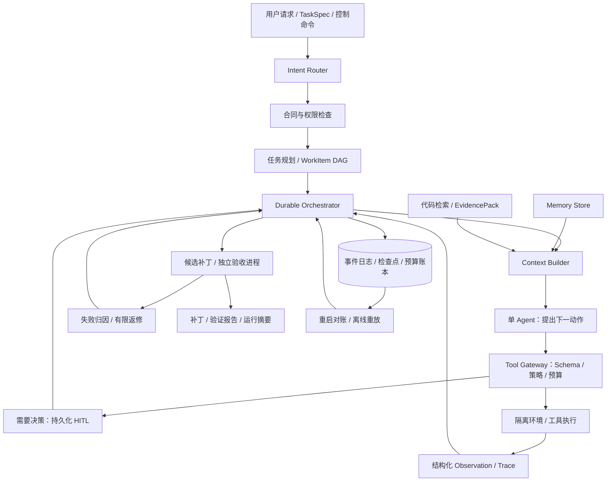

# Horizon Agent 能力详细设计

> 版本：0.2.0；日期：2026-09-19；状态：完整目标设计，部分基础代码已开发，详见[开发进度](development-progress.md)。
> 对应主文档：[Coding Agent 开发设计](coding-agent-development-design.md)。
> 本文具体化主文档的机制并新增必要需求，原有强制项继续有效。
> 本文中的路径、接口、Schema、命令和测试是完整目标合同，不表示已全部实现。M0～M5 仅作技术顺序参考，不自动启用固定角色编排。

## 1. 选用哪些 Agent 能力

| 能力 | 首版决定 | 具体职责 | 暂不引入的部分 |
|---|---|---|---|
| 架构 | 必须 | 单执行 Agent；Plan–Execute–Verify 外循环；工作项内 ReAct；事件驱动恢复 | 自由协作的多 Agent、分布式调度、强制 LangGraph |
| 意图识别 | 必须 | 控制命令路由、任务类型、执行模式、必要信息检查 | 单独训练意图分类模型 |
| 上下文分层与压缩 | 必须 | 六层上下文投影、预算、事实保留、工具消息配对 | 仅靠扩大上下文窗口 |
| Memory | 必须 | Run 内任务记忆、同仓库跨 Run 的有证据项目记忆 | 跨用户记忆、自动把失败猜测沉淀为经验 |
| Code RAG | 必须 | 路径/符号检索 + SQLite FTS5/BM25；带版本的代码证据包 | 默认向量数据库、GraphRAG、全量调用图 |
| Tool Calling | 必须 | 有类型的工具目录、验证、权限、执行、结果配对 | 首版支持任意第三方 MCP Server |
| Harness | 项目核心 | 状态、事件、权限、预算、工具、记忆、验证、恢复的统一控制 | 另套一个重框架代替核心控制逻辑 |
| Human-in-the-loop | 必须 | 澄清、精确操作审批、暂停/取消、持久化待办与恢复 | 每次读文件都确认；自动审批外部写入 |
| Fallback | 必须 | 有界重试、检索降级、压缩降级、恢复和显式模型切换策略 | 静默降标准、自动增加预算、无上限切模型 |
| 反思/重规划 | 必须，有限 | 失败分类、重复动作检测、计划修订 | 每步额外 Reviewer LLM、自主改任务合同 |
| 评测/可观测性 | 必须 | 全路径 Trace、基线、消融、故障注入、长程样本 | 仅看一个 Demo 或仅用 LLM 打分 |

向量检索、reranker、MCP 和多 Agent 作为明确可选项，缺少它们不阻止首版验收。必要能力均有新增需求 ID 和实施里程碑，见本文第 15～16 节及[逐项追踪矩阵](requirements-traceability.md)。

## 2. 采用的架构与 Harness 边界

### 2.1 运行路径



这里的“单 Agent”允许在不同阶段使用规划、执行、摘要提示词；调用串行执行，共享一个 Run 的预算和受控状态。Validator 是确定性服务，不根据 Agent 自评决定通过。

### 2.2 两层循环

- 外层：选择 READY WorkItem → 执行 → 验证 → 通过或有限返修 → 更新计划 → 最终验收。
- 内层：取证/检索 → 构建上下文 → 模型提出动作 → Gateway 执行 → 观察 → 下一步。
- 重规划触发：相关测试失败、依赖判断被推翻、重复动作达到阈值、证据不足；每次产生新的 `plan_version`。
- 初始无进展判定：相同规范化动作连续出现 3 次，且结果摘要、工作区树和验证状态均无变化。触发重规划，最多 2 次；仍无进展则等待澄清或失败。
- 这些计数阈值是可配置初值，不是已证实的最优参数；不能因模型自称“有进展”而清零。

### 2.3 Harness 负责什么

模型负责提出计划、检索查询、编辑候选和修复思路。Harness 决定是否执行、写到哪里、保留什么、何时暂停、如何恢复、是否通过。这些决策落在程序状态机、权限和证据上。

核心实现采用 Python + Pydantic + SQLite + Git/内容寻址产物 + Linux Docker/SWE-ReX。工具 Schema 由 Pydantic 生成，CLI 采用 Typer。版本在 M0 锁定，不增加 Redis、消息队列或服务集群。

### 2.4 与 mini-SWE-agent 的真实集成边界

上游 v2 默认通过 native tool calling 调用 bash，当前 `LitellmModel` 也直接传入 `tools=[BASH_TOOL]`。所以不能声称改一份配置就能获得我们的任意工具目录。[v2 文档](https://mini-swe-agent.com/latest/advanced/v2_migration/) · [模型适配源码](https://github.com/SWE-agent/mini-swe-agent/blob/main/src/minisweagent/models/litellm_model.py)

实现拆分为两条运行路径：

1. `upstream_baseline`：固定上游版本与原始工具/提示词，保存原始 trajectory，作为实验 A；执行仍在统一隔离环境中。
2. `horizon`：自研 Orchestrator 驱动单步 Agent；复用上游可复用的模型/环境组件和循环范式。新增 `HorizonModelAdapter` 接收工具 Schema，`MiniSweAdapter` 规范化消息和动作，所有副作用只能经 Tool Gateway。

禁止把上游 `DefaultAgent.run()` 当成不可中断的黑盒嵌入 Harness，也禁止把 `step()` 误当作纯模型推理：上游 step 含动作执行。适配器必须把“请求下一动作”和“执行动作”拆开；无公开扩展点时编写有归属声明的兼容适配类，不能运行中 monkey patch。

规划、执行、摘要三个模型角色由同一个 `ModelGateway` 计费、重试、记录。没有额外的隐形模型调用通道。

## 3. 意图识别、请求路由与任务分解

### 3.1 双维度分类

| 字段 | 取值 | 用途 |
|---|---|---|
| `request_kind` | `task / status / resume / cancel / approval / clarification` | 控制请求与工作请求分开 |
| `task_kind` | `bugfix / feature / refactor / tests / explain / review / unknown` | 选择规划模板和建议验证 |
| `execution_mode` | `read_only / plan_only / workspace_write` | 限制可调用工具 |
| `target_run_id` | 显式 ID 或唯一当前任务 | 防止取消/恢复错误 Run |
| `missing_fields` | 仓库、目标、关键验收信息等 | 决定能否启动 |
| `evidence_spans` | 用户原文片段 | 保留分类依据 |

请求路由顺序：显式 CLI 命令 → 结构化 TaskSpec → 有限规则 → 必要时一次结构化模型分类。入口分类若需要模型，先建立有成本记录的 admission session；它只允许模型和只读发现，不拥有写入权。之后把该调用和费用关联到新 Run，拒绝的请求也保留 intake 记录。

admission 最多一次分类请求，输出上限初值 1,024 tokens，且受入口配置的费用/时间上限约束；配置缺失时仍可用显式 TaskSpec 路径。入口事件存 `intake_events`，以 intake_id 为流标识；创建 Run 后追加 `INTAKE_ATTACHED` 引用其事件范围和已计费用，不改写旧事件、不重复收费，避免 Run 尚不存在时违反 events.run_id 外键。

模型置信度只供观测，不能把“置信度超过 0.9”当作写权限。有效工具权限是：用户授予范围 ∩ TaskSpec ∩ 系统策略 ∩ 当前模式；识别结果只能收窄，不能扩张。

### 3.2 行为示例

| 用户输入 | 路由 | 行为 |
|---|---|---|
| “解释一下 parser 怎么处理空输入” | explain + read_only | 读源码、检索并引用；无编辑工具 |
| “检查这个补丁的问题” | review + read_only | 读 diff、输出发现；运行项目代码需另有已授权的测试模式 |
| “修复空输入崩溃，保持返回类型不变” | bugfix + workspace_write | 建合同、拆任务、改代码、验证 |
| “设计缓存接口，先给方案” | feature + plan_only | 可读代码、生成计划；不应用代码补丁 |
| “继续” | resume | 仅恢复已存在且权限仍有效的 Run；不批准挂起审批 |
| “取消 run_123” | cancel | 即时持久化取消请求，不经过 LLM |

只有缺少会实质改变结果的信息时才创建澄清项；默认路径、日志目录、排序方式等普通配置直接采用默认值并记录。TaskSpec 中已有信息不重复询问。

### 3.3 合同与 Plan Schema

`TaskSpec` 增加 `execution_mode`、`task_kind`、`authority_scope`、`model_policy_id`、`validation_policy_hash`、`memory_scope`。代码仓库来自用户提供路径或固定 git ref；不由模型猜测。

每个 WorkItem 增加：`requirement_ids`、`evidence_refs`、`allowed_tools`、`completion_checks`、`affected_paths_hint`。hint 只帮助规划，不构成文件写权限。

Planner 输出后程序检查：ID 唯一、DAG 无环、引用存在、所有强制验收条件至少被一个工作项覆盖、计划未增减 TaskSpec 的验收标准、局部预算总和不超总预算。工作项数量服从任务本身，简单任务可以只有一项。

计划可自动修订；用户目标、写权限、硬预算、必需验收条件的变更必须形成 `TASK_SPEC_AMENDED` 并有用户来源。新版本保留原合同、重新评估已通过检查的适用性；只因范围变化而失效的检查需重跑。

## 4. 上下文分层与压缩

### 4.1 六层 ContextPack

主文档 A/B/C/D 分层细化如下；层级表示装配优先级，不表示把低可信文本提升为系统指令。

| 层 | 内容 | 来源 | 压缩与失效规则 |
|---|---|---|---|
| L0 | 权限策略、当前有效工具 Schema、输出合同 | 受信配置 | 不由 LLM 改写 |
| L1 | TaskSpec、required 验收、预算剩余、当前计划 | 权威事件投影 | 保留原文/结构化值与 hash |
| L2 | 当前工作项、活跃事实、决策、未解决失败 | Run Memory / Fact Ledger | 关键事实精确保留，历史事实可索引化 |
| L3 | 代码/文档证据、同仓库已验证记忆 | Retrieval / Project Memory | 按相关性与 token 预算选取；版本变更需重检 |
| L4 | 最近完整的模型—工具—结果轮次 | Canonical Transcript | 不截断未配对 tool call |
| L5 | 历史阶段摘要、旧日志引用 | Compaction / Artifact Store | 摘要可替换，但原始证据不删除 |

Context、Memory、RAG、Trace 的关系：Memory 存可复用事实，RAG 选相关外部证据，Context 是此次模型可见的组合，Trace 是真实发生的执行记录。四者不互相替代。

### 4.2 ContextPack 合同

```json
{
  "context_id": "ctx_example",
  "run_id": "run_example",
  "source_head_seq": 142,
  "task_spec_hash": "sha256:...",
  "plan_version": 2,
  "policy_hash": "sha256:...",
  "workspace_revision": "tree:...",
  "tool_schema_hash": "sha256:...",
  "mandatory_fact_ids": ["fact_public_api"],
  "evidence_ids": ["ev_parser_01"],
  "summary_ids": ["sum_stage_01"],
  "recent_turn_range": [18, 22],
  "estimated_input_tokens": 24000,
  "estimator_version": "configured",
  "content_hash": "sha256:..."
}
```

完整发送内容存受保护 Artifact；日志投影使用脱敏版本。不能为了声称“完整重放”导出密钥或仓库外内容。采用 canonical model message + provider 专用不透明字段，两者不强制转换为统一的字符串消息列表。

Trace 记录实际可获取的模型输出、简短决策说明、工具调用和计量，不要求获取或导出模型隐藏推理；供应商 opaque 字段只能在其协议允许的会话内恢复。

### 4.3 Token 预算与装配算法

计算可用输入预算：`input_budget = model_context_limit - reserved_output_tokens - tool_schema_tokens - safety_margin`。若 tokenizer 已把工具 Schema 算进总输入，则不能再重复扣除。使用当前模型的 tokenizer；不可用时记录保守估算方法和误差余量。

装配顺序：L0/L1 → L2 活跃事实 → L4 最近完整轮次 → L3 证据 → L5 摘要。输入阈值使用这个可用输入预算，沿用 70% 软压缩、85% 强制压缩初值。L3 初始上限 8,000 tokens、12 个片段，仅为可调配置。

硬合同本身放不进窗口时进入 `context_required_overflow`：保留任务，阻止新模型调用，等待调整任务或用户允许的兼容大窗口模型。不得静默删掉验收条目。

### 4.4 压缩流水线

1. 找到已结束的完整轮次边界；保留所有未结束 tool call 和当前工作项失败。
2. 将大日志外置、合并重复观察，优先做确定性削减。
3. 从权威数据精确复制 L0/L1/L2 的 mandatory payload，保存 ID 和内容 hash。
4. 对较早完整轮次生成结构化摘要：`covered_seq_range / decisions / failures / changed_paths / evidence_refs / next_actions`。
5. 校验引用、区间、Schema、必保字段内容 hash、消息配对和 token 预算。
6. Artifact 成功落盘后，原子记录 `CONTEXT_COMPACTION_FINISHED` 与新的 ContextPack 引用。
7. 失败保留旧投影，降级为确定性 handoff 包；仍超限则阻塞，不重试到耗尽所有费用。

“保留率 100%”只覆盖明确定义的必保字段及原文哈希，不等于能证明任意自然语言摘要没有语义损失。自由文本摘要的准确性要通过固定事实问答和下游任务结果另外评测。

每次只重写摘要覆盖范围，不改 canonical transcript。不跨未完成工具轮次截断，不保留孤立的 tool result；多工具轮次若未执行的调用被取消，补充显式取消 observation 后再压缩。

### 4.5 Session Handoff

恢复或新窗口开始时读取：合同 → 当前计划 → 最近 checkpoint → 活跃事实 → 未解决失败 → 当前 diff → 下一条已授权动作。先核对工作区指纹，旧路径/行号不匹配则重检索。

结构化进度和阶段产物有助于跨会话延续；本项目把它们变成有来源和版本的状态投影。这个设计参考了上游长程 Harness 的阶段交接经验，并增加恢复一致性约束。[长程 Harness 参考](https://www.anthropic.com/engineering/effective-harnesses-for-long-running-agents)

## 5. Memory：从何而来、存哪里、何时相信

### 5.1 记忆类型

| 类型 | 范围/存储 | 写入者 | 读取时机 |
|---|---|---|---|
| Working Memory | 当前 ContextPack | Context Builder | 每步 |
| Episodic Memory | Run 事件和 Artifact | Orchestrator | 恢复、查询历史、回放 |
| Run Semantic Memory | `memory_entries` 的 run scope | Fact Ledger / MemoryWriter | 压缩、切工作项、恢复 |
| Project Memory | `memory_entries` 的 repo scope | 有证据的 promotion 流程 | 新任务的首次检索、相关步骤 |
| Procedural Memory | 版本化 prompt/操作 recipe 文件 | 开发者或用户 | 按任务类型装配 |

首版不让 Agent 自动修改自身系统提示词、安全策略和工具代码；跨 Run 的经验是建议性知识，不是可执行策略。

### 5.2 MemoryEntry

```text
memory_id, revision, kind, scope_type(run|repo), scope_id
repo_id, source_run_id, task_spec_hash, statement
source_event_ids[], evidence_refs[], confidence(observed|inferred|model_claim)
status(candidate|active|stale|superseded|rejected|revoked)
file_dependencies[{path, content_hash}], environment_fingerprint
created_at, last_verified_at, expires_at?, supersedes_id?
visibility(local_private), promotion_reason?, schema_version
```

`repo_id` 按规范化源地址与项目命名空间生成；不能只用文件夹名。不同 fork/本地独立仓库默认不共享记忆。

### 5.3 写入、升级与检索

1. 工具或验证器产生 observation：直接生成有来源的事实，比如“在镜像 X、revision Y，命令 Z 退出 0”。
2. 模型总结可建议 memory candidate，但不能直接把 `confidence` 写为 observed 或状态写为 active。
3. Run 内有效证据经程序验证后激活。项目记忆只自动沉淀可直接核验的路径、符号、构建指令和检查结果；一般化的“遇到错误就执行命令”必须保留 candidate 或由用户确认。
4. 项目记忆查询先按 repo、来源权限、有效状态过滤，再按相关性排序；使用前检查依赖文件 hash 和环境指纹。
5. 用户可查看、拒绝、撤销项目记忆。撤销写入事件并禁止未来召回，历史审计保留撤销记录。

示例：一次失败的 `pytest` 命令可以作为“失败及原因”保存，不可写成“这个仓库的标准测试命令”。测试通过也只证明当时提交与环境通过，不说明所有未来任务正确。

### 5.4 失效、冲突与污染隔离

- 文件编辑、重命名、删除、base commit 变化：标记依赖这些文件的记忆 stale；再次验证后创建新 revision。
- lockfile、工具链、镜像 digest 变化：测试命令和依赖结论失效。
- 两条有冲突的记忆并存并标 conflict，不用“最近一条”自动覆盖高可信旧记录；重新读取当前源码或请求澄清。
- 用户约束仍以 TaskSpec 为权威，repo README、注释、检索片段和模型记忆不能覆盖。
- 正式 benchmark 为每个 instance/variant 建独立 memory namespace；默认关闭跨题、跨组项目记忆注入，防止从其他变体获得答案。Memory 消融使用固定、预先准备且无答案的记忆种子。

## 6. Code RAG：代码库检索与证据装配

### 6.1 首版为什么用轻量检索

代码任务常提供路径、函数名、错误栈和测试名。首先做精确检索与 BM25，能直观看到召回源、更新成本和失败原因。SQLite FTS5 原生提供 BM25；更匹配的结果分值更小，查询按升序取前列。[SQLite FTS5 官方说明](https://www.sqlite.org/fts5.html#the_bm25_function)

向量检索与 reranker 预留 `RetrieverPort`，只在固定检索样本显示词汇不匹配且改进能覆盖成本时开启；不把它作为默认基础设施或首版验收前提。

### 6.2 索引来源与切分

- 来源：本次 Run 的仓库源码、测试、README/架构文档以及被授权的 repo memory；首版不做互联网搜索、Git 历史答案搜索。
- 排除：`.git`、vendor、生成文件、二进制、密钥路径、超限文件。排除清单及原因记录在 index manifest，不能造成静默空检索。
- Python 采用标准库 AST 提取函数/类范围；语法不完整或其他语言先按文件段落/行窗口切分，标记 `parser_kind=line_window`。Tree-sitter 多语言符号索引是后续优化。
- 初始片段目标 200～800 tokens，过长符号按完整行切分并保留父符号 ID；代码字符串保持原样，归一化 token 只用于索引。
- 标识符建立原文与 snake/camel 分词视图；中文任务可从已观察的错误栈/用户给定标识符补充查询，不能凭空补出符号。

### 6.3 数据模型和版本

```text
RepoSnapshot: repo_id, run_id, base_commit, workspace_revision,
              manifest_hash, created_at, parser_version
CodeChunk: chunk_id, snapshot_id, path, start_line, end_line,
           symbol?, content_hash, content_ref, language, parser_kind
RetrievalQuery: query_id, run_id, work_item_id, query_text,
                requested_revision, channels, top_k, token_limit
Evidence: evidence_id, chunk_id, path, line_range, content_hash,
          snapshot_id, selected_at, source_kind, trust_level
EvidencePack: query_id, revision, items[], coverage_hint,
              status(ok|empty|degraded), degraded_reason?, token_count
```

版本不能只看 Git HEAD：未提交编辑同样改变源码。`workspace_revision` 由受控工作区 manifest 的文件内容哈希构成；在串行写动作结束后更新 revision，并增量重建受影响文件。删除文件删除 live index 条目，但历史 Evidence Artifact 仍保留供回放。

新增 `repo_snapshots / code_chunks / code_chunks_fts` 表；索引构建后原子切换 active snapshot 指针。不得把两个 snapshot 的片段拼成一个“当前代码”证据包。

### 6.4 检索流水线

1. 从 TaskSpec、当前工作项和最近失败提取查询；附 repo_id/revision 范围。
2. 路径/符号精确匹配、受控 `rg`、FTS5 BM25 三路召回，各取上限 20。数据库查询使用绑定参数；用户原文不能拼接 SQL，FTS 查询运算符须经词法校验或转义。
3. 先按允许路径和当前 revision 过滤，再融合；不能先把无权内容交给模型再过滤。
4. 初始使用 RRF：`score = Σ 1/(60 + rank_i)`，重复 chunk 合并，按 score 降序；常数为实验配置。
5. 补充同文件必要导入和相关测试片段；预算内最多 12 个片段、单文件默认最多 3 个，显式指定目标符号可例外并记录。
6. 在注入前重新核对文件 hash，陈旧片段重读或丢弃，不能只修正行号。
7. 生成 EvidencePack 与 `RETRIEVAL_COMPLETED`，Context Builder 把源 ID 和片段作为低可信证据输入。
8. Planner/编辑提案记录使用的 evidence_ids；源码证据可证明位置，不可证明测试已经通过。

M0/M1 无索引时允许 Gateway 直接搜索源码；M3 的增量索引启用后，对文件修改、删除、恢复都要做失效测试。

### 6.5 空结果与降级

- 空结果是合法结果：记录 `empty`，可在既有仓库范围内改写查询最多一次，再做有界搜索。
- FTS 不可用：降级到精确路径/符号 + `rg`，标记 `degraded` 和原因。
- 可选 embedding/reranker 超时：使用已有词汇结果，不能填造“相关片段”。
- 同一动作需要的源码仍不可得：返回 evidence_missing，重新规划或澄清；不允许把历史过期片段冒充当前。

### 6.6 一条实际数据流

“修复空字符串在 parse() 中崩溃” → 意图为 bugfix → 查询 parse/对应异常 → 召回实现和测试 → EvidencePack 带文件 hash → 模型提交精确 patch → Gateway 校验目标 hash → 更新工作区 revision → 失效旧索引/记忆 → 运行受保护测试 → 结果成为 Run Memory → 生成阶段摘要与检查点。

## 7. Tool Calling 与执行网关

### 7.1 第一版工具目录

| 工具 | 输入要点 | 输出要点 | 权限/副作用 |
|---|---|---|---|
| `search_repo` | query、path filters、top_k | EvidencePack | 只读，有界检索 |
| `read_file` | repo 内路径、行范围、expected_hash? | 内容/当前 hash/截断信息 | 只读，拦截越界和符号链接逃逸 |
| `apply_patch` | patch、expected_workspace_revision | 候选 diff、每文件新旧 hash | 只允许授权路径；事务式接纳 |
| `run_command` | argv 或 shell、cwd、timeout | exit status、日志引用、候选 diff | 在一次性工作副本运行 |
| `run_checks` | 已注册 check_ids | ValidationReport | 命令由 Harness 的受保护配置决定 |
| `record_note` | statement、evidence_ids、kind | candidate_memory_id | 只能提出记忆候选 |
| `request_input` | 缺失字段、原因、选项建议 | pending_request_id | 创建持久化澄清，不替人作答 |
| `submit_candidate` | work_item_id、summary、evidence_ids | validation_pending | 仅申请验收 |

工具列表根据模式和阶段裁剪。read_only/plan_only 下不下发 `apply_patch` 或通用 `run_command`，不能用一个“只读 Shell”标签假装任意代码不会写文件。

外部写入（push、PR、发消息）在首版不提供执行工具，只设计授权/对账接口并用可控 Fake 验证边界。预先授权的 workspace_write 工具正常执行，不反复询问。

### 7.2 Schema 示例

```json
{
  "name": "read_file",
  "description": "读取当前仓库中的文本文件，返回版本哈希和行范围。",
  "parameters": {
    "type": "object",
    "properties": {
      "path": {"type": "string", "minLength": 1},
      "start_line": {"type": "integer", "minimum": 1},
      "end_line": {"type": "integer", "minimum": 1},
      "expected_hash": {"type": ["string", "null"]}
    },
    "required": ["path", "start_line", "end_line", "expected_hash"],
    "additionalProperties": false
  }
}
```

这是供应商无关的领域 Schema。Provider Adapter 做供应商兼容转换；M0 契约测试确认 native tool calling、参数解析、多 tool call 和 observation 配对。服务端再次验证 `end_line >= start_line`、最大行数、UTF-8/二进制、canonical path、symlink 和文件 hash，不能只信 JSON Schema 或模型参数。

### 7.3 调用生命周期

```text
PROPOSED -> SCHEMA_VALIDATED -> POLICY_CHECKED
  -> APPROVAL_PENDING? -> APPROVED
  -> BUDGET_RESERVED -> INTENT_COMMITTED -> DISPATCHED
  -> RESULT_STORED -> EFFECT_RECONCILED -> OBSERVED -> SETTLED
```

记录 `logical_call_id`、`provider_tool_call_id`、`attempt_id`、`tool_schema_version`、`normalized_args_hash`、`policy_hash`、`lease_epoch`、`workspace_revision`。一个逻辑动作的重试复用逻辑 ID、增加 attempt；参数实质变化是新动作并重做授权。

每一步写事件；`INTENT_COMMITTED` 前不执行。记录所有异常 observation，非法参数最多返问模型 2 次并计费；无响应不伪造成功。一次模型返回多个工具时首版顺序处理，每次执行前重查预算、取消和工作区版本。前序修改导致后续 expected_hash 失效则退回模型。

### 7.4 Shell 不能由字符串黑名单构成安全边界

任意 shell、Python 脚本、项目测试都可以读写文件。非 root Docker 也不会自动保证仓库内路径白名单。因此首版必须采用：

1. 权威工作区与控制器数据（SQLite、审批、验收配置、API 凭据）不暴露给 Agent 的执行容器。
2. 通用命令运行在一次性工作副本中：无宿主凭据、无 Docker socket、默认禁网，受资源/时间限制。
3. 副本中的写入只形成候选变更；通过新旧 hash、路径、文件类型、大小、symlink 和敏感内容检查后，Gateway 才将允许的 patch 接纳到权威工作区。
4. 禁止路径在能用 mount/权限强制只读时先强制；无论是否可写，禁止路径变更都不得接纳。允许临时构建文件写在指定 scratch/cache 区，但不会自动进入最终 patch。
5. `read_file` 直接执行严格路径检查；候选 patch 不可包含绝对路径、`..` 逃逸或用 symlink 指向仓库外。

约束“拦截越权写入”指权威工作区和宿主资源不被越权改变；恶意命令在隔离副本中造成的改动被丢弃并记录。不能声称阻止了容器内所有写入或解决了所有容器逃逸风险。隔离设置参考 Docker 官方的 namespaces、capabilities 和 daemon 暴露边界。[Docker 安全说明](https://docs.docker.com/engine/security/)

### 7.5 副作用、幂等与工作区接纳

- read_file/search：可重试，结果带当时版本，不保证两次内容相同。
- apply_patch/command 候选：接纳前持久化 intent、候选产物和前后树 hash。恢复遇到前树则可接纳，后树则只补对账，中间态则隔离候选并恢复检查点，禁止盲目重复应用。
- run_checks：在干净验证副本重跑；终止旧进程后再启动，检查 ID 和输入树一致。
- 运行 Shell 时不存在任意命令“天然幂等”的保证；它只在无外部写权限的临时副本执行，其返回 patch 受统一接纳控制。
- 幂等键保证同一操作在账本中只提交一个结果；物理外部副作用仍遵循主文档的 unknown-state 规则。

### 7.6 MCP 的位置

MCP 是未来工具来源之一，不是 Agent 推理循环或权限机制。后续的 `McpAdapter` 必须接入同一 Gateway，静态批准 server/tool 清单，冻结 Schema，给网络端点和数据流单独授权。当前首版直接注册 Python 工具，不依赖 MCP Server 作为必备条件。

## 8. Human-in-the-loop：可恢复的人类介入

### 8.1 哪些情况介入

| 类型 | 触发 | 人的决定 |
|---|---|---|
| `clarification` | 目标、仓库或验收语义存在关键歧义 | 补齐字段，创建合同版本 |
| `approval` | 已支持动作超出当前授权，且策略允许请求授权 | 精确批准/拒绝一次动作 |
| `budget_change` | 需要增加硬预算 | 决定新的上限；默认不增加 |
| `recovery_decision` | 副作用结果未知、工作区被人工修改 | 提供对账证据或选择恢复路径 |
| `review_checkpoint` | 用户 TaskSpec 明确要求阶段确认 | 接受候选或说明返修要求 |

策略明确禁止的动作直接拒绝，不通过“让人点确认”绕过系统禁令。测试通过与用户批准是两个字段；人工批准不能把失败测试变为 passed。

### 8.2 HumanRequest 模型

```text
request_id, scope_type(intake|run), intake_id?, run_id?, work_item_id?, request_kind, status
logical_call_id?, tool_name?, normalized_args_hash?, tool_schema_hash?
task_spec_hash, plan_version, policy_hash, workspace_revision, lease_epoch
display_summary, evidence_refs[], diff_ref?, allowed_decisions[]
requested_at, expires_at, timeout_action, resume_state
decision_id?, decision_value?, decision_actor?, decision_at?
```

审批状态：`PENDING -> APPROVED / REJECTED / EXPIRED / CANCELLED / STALE`。审批内容冻结工具、参数、目标和版本；消费审批时重新检查当前权限与 hash。参数、策略、工作区或合同变化使审批 stale，并创建新请求。

Run 尚未建立时的澄清挂在 intake scope，intake_id/run_id 恰好一个有值，此时绑定用户请求 hash 和 admission 截止时间；不存在的 plan/workspace 字段可空。任何批准执行的请求必须属于 Run scope，且版本、权限和工具参数字段全部齐全。创建 Run 后用关联事件引用已解决澄清，不改写历史请求。

### 8.3 持久化与可信入口

- 写 `HUMAN_REQUEST_CREATED` 和请求投影，与进入 `WAITING_FOR_USER` 同一事务提交。
- 进程退出后请求仍存在；resume 首先展示/查询未决项，不自动当作同意。
- 决策通过本机 CLI 的独立控制通道进入。控制 socket/凭据/SQLite 不挂载给 Agent，模型输出和仓库里的“approved=true”无效。
- 首版单用户，使用 OS 用户边界和仅本机可读的控制凭据；不是多租户鉴权系统。
- `decision_id` 幂等；决策提交、审批消费与工具 intent 建立关联。审批一次性消费，多次点击不能多次派发。
- 对于同一 Run 重启后的未执行动作，可以重新核验并绑定新 lease epoch；不能把旧 Worker 获得的审批继续交给旧 Worker 使用。

### 8.4 暂停、超时、取消

初值 `approval_ttl_seconds=1800`，等待不产生模型调用。TTL 到期标记 EXPIRED 并令 Run 失败，原因 `human_input_timeout`；未配置 TTL 时仍受整个 Run 的墙钟硬截止约束。批量评测无人值守模式采用 fail/blocked 策略并记录原因，不自动批准。

沿用墙钟预算定义：从 Run 启动到现在，包含等待与宕机；恢复不会重置。另记录 active compute time 用于分析。人工增加截止时间必须产生合同变更事件。

取消写 durable cancel flag，使所有待决请求 CANCELLED；Gateway 执行前最后一次检查。已运行命令终止进程组，无法确认终止时不得派发新命令。等待态记 `resume_state`，解决后回到原阶段，而非一律直接进入 RUNNING。

当前有界实现把这条规则落为两阶段协议：无在途 effect 时直接 `CANCELLED`；否则先写
`CANCEL_PENDING`/`cancel_requested`，active gate 停止新派发，recovery gate 仅接收迟到 receipt、
unknown 分类或显式工具处置。单一 Docker `run_check` 可由可信 CLI 用持久 call ID 核验并停止
标签容器，`CANCEL_SANDBOX_STOPPED` 保存容器名和 image digest；普通宿主进程组和 Provider
主动取消仍未实现。完整边界见[恢复安全取消](recovery-safe-cancellation.md)。

## 9. Fallback、重试与熔断

### 9.1 四类行为不能混为一谈

- Retry：同一操作，前提是可安全重试，次数与耗时有界。
- Recovery：进程或环境失效后，对账再续行。
- Fallback：替换检索策略、摘要方式或已批准的模型，必须记录能力和行为变化。
- Repair/Replan：代码或思路失败，产生新动作或新计划；不是网络重试。

### 9.2 决策表

| 故障 | 处理链 | 停止条件 |
|---|---|---|
| 429、明确 5xx、短暂网络失败 | 按 Retry-After 或退避重试；检查费用 reservation | 每逻辑请求至多 3 次尝试，累计等待上限 60s 或更早硬截止 |
| 模型请求超时且服务端可能已计费 | 旧 attempt 记 unknown，保留费用预留；重试创建新 attempt | 预留不足停止，不按零费用继续 |
| 401/403、模型不存在、Schema 不支持 | 返回配置/能力错误 | 不循环重试、不自动换账户 |
| 响应格式错 | 记录原始响应，最多 2 次格式修复且计费 | 仍非法则失败 |
| 上下文超限 | 确定性裁剪 → 合同保留压缩 → 重新估算 | 最多一次上下文修复；必保区超限则阻塞 |
| FTS/可选向量不可用 | 词汇检索或直接 search/read | 有证据则标 degraded 继续，否则 evidence_missing |
| 摘要模型失败 | 使用固定合同 + Fact Ledger + 最近完整轮次 | 包仍过大则停止；不丢约束 |
| Sandbox 丢失 | fence 旧 Worker/容器 → 校验 checkpoint → 恢复 | 校验失败或不能确认旧执行停止则阻塞 |
| 测试失败 | 结构化反馈 → 修复 → 重测 | 达返修上限失败；不降验收标准 |
| 高风险效果未知 | 查询可验证 receipt → 人工对账 | 不自动重放 |
| SQLite/Artifact 写失败 | 停止启动副作用，保留本地应急错误记录 | 主存储恢复并对账前不降级到内存继续 |

Gateway 是重试计数的唯一所有者。上游 SDK 隐式重试必须关闭或通过 hook 纳入同一计数与 Trace；不能外层 3 次 × 内层 3 次 × Agent 3 次造成实际 27 次。

### 9.3 单机 Circuit Breaker

首版在 SQLite 保存 `provider_health` 投影，并记录健康事件。key 为 `(endpoint, provider, model, operation, credential_ref)`；credential_ref 是本地标识，不是秘密值。

初始策略：连续 3 个符合规则的临时故障进入 OPEN，30 秒冷却后 HALF_OPEN，只允许一个真实请求探测；成功 CLOSED，失败再次 OPEN。超出 Run 剩余预算不探测。参数均写入配置快照。

重启加载 breaker 状态；它只是减少持续故障时无效请求，不参与任务验收。业务测试失败、拒绝越权和 401 不计入此临时故障计数。

### 9.4 模型 fallback

默认关闭自动跨模型切换。`ModelPolicy` 可以在 TaskSpec 中预先定义 primary 和最多一个 fallback，启用后无需每次重问，但必须满足：

- 数据允许流向该 provider；相同模型能力要求（工具调用、Schema、有效上下文、消息格式）。
- 仍满足原 TaskSpec、路径权限和总预算；切换不是获得新权限的方式。
- 从最近完成的工具轮次/检查点构造新的 ContextPack，保留原始 provider 消息为 Artifact；不把不兼容的 opaque reasoning 字段发送到另一供应商。
- 记录模型、原因、旧/新配置 hash、成本和 `execution_profile_changed=true`。
- 原调用若状态未知，先保留可能费用，不释放后再调用。

正式 A/B/C/D 可比实验禁用自动模型切换；另行报告可靠性策略实验，不能把换强模型或额外预算产生的结果算成 Harness 单项提升。

### 9.5 对用户可见的运行质量

`RunSummary` 增加 `quality_flags[]`、`fallback_history[]`、`unknown_operations[]`、`cost_status`、`limitations[]`。例如 lexical-only retrieval 可以在 required tests 通过后以“通过，检索降级”结束；若验收证据未知则不能通过。

## 10. 把恢复、预算和验证连接起来

### 10.1 单写入者和 fencing

单 Worker 也可能因旧进程卡死后恢复而出现并发。Lease 必须带递增 `lease_epoch`；每次事件追加和工具派发都比较 epoch 与 expected_seq。

TTL 过期不证明旧 Shell 已停止。接管前隔离旧容器并确认命令进程组退出；无法确认则 `RECOVERY_BLOCKED`。SQLite/Artifact、秘密、权限配置不在执行容器可写范围内。

### 10.2 Step 与 Checkpoint 的两个边界

每个已接纳写动作必须保存内容寻址的候选 patch/文件产物、前后树 hash 和接纳事件；这满足“每步有恢复边界”。每 5 步的完整 checkpoint 只是加速恢复，不可把间隔内文件变化丢掉。

恢复时先保全现有脏副本和悬空操作证据，再建立新工作区：最近一致 snapshot + 已接纳的 patch 链，检查每次前后树 hash。重放事件只重建数据库状态，不会神奇恢复文件；文件恢复由 Artifact 链负责。

保留主文档的 prepare/commit 两阶段语义，但它不是跨数据库和文件系统的分布式 2PC：先写不可变产物并验证，再用一个 SQLite 事务提交 checkpoint/event/run 指针。孤立产物可回收，缺失产物必须阻塞。运行中进程、内存、网络连接不属于文件 snapshot。

### 10.3 Budget 统一计数

分类、规划、执行、摘要、查询改写、格式修复、探测、验证、重试都计入同一 Run 或 admission ledger；model role 不影响硬上限。resume 不把账本清零，execution fork 是新预算并报告来源。

Decimal 记录费用；价格表有版本、provider model ID、输入/输出/cache 计费规则。无可信价格时保留 token/attempt/time 硬限制，并按 TaskSpec 的 unknown_cost_policy 阻塞或显式允许，不声称有精确美元封顶。

### 10.4 验证证据的不可篡改边界

- 最终验收定义和 required checks 由控制器保存；Agent 只能调用注册 check_ids，不能把命令改成 `true`。
- 验证在独立进程和干净副本运行，输入为 base commit + 被接纳候选 patch；测试结果和报告由验证器写，Agent 不能写 passed 字段。
- 允许任务明确要求的新增/修改测试，但不能删除或减弱外部提供的受保护验收；测试 diff 进入审查，最终 protected tests 从控制器只读挂载或按官方 harness 注入。
- 保存 baseline 的已知失败，区分新增回归、任务目标失败和环境错误，不把“基线就红”算修复通过。
- SWE-bench 等外部 gold tests/patch 不进入检索、记忆或模型上下文；只允许评测器访问。
- 程序化验证不能保证对任意恶意代码绝对不可作弊；本版本通过隔离控制数据、固定测试与可核查补丁减少绕过面，持续保留反例。

### 10.5 执行分叉与状态闭合

按主文档 FR-506，M5 必须支持受控 `fork`：创建新 Run/工作区、记录父 Run 和 checkpoint、使用新的预算，保持旧事件流只读。它不要求复现供应商的随机输出。

所有非终态都接受 cancel/failure/hard-deadline；从 WAITING_FOR_USER 返回前核验 `resume_state`、有效审批、版本和预算。压缩、验收和准备检查点阶段也要支持终止，不能只给 RUNNING 状态画取消边。

## 11. 模块、数据表与服务接口

下列文件是目标模块边界，不要求机械照搬目录。当前已用合并后的 `application/context.py`、
`domain/context.py`、`adapters/retrieval/sqlite_fts.py`、`domain/retrieval.py`、
`tools/gateway.py`、`application/tool_recovery.py` 和 `adapters/workspace/promotion.py` 实现部分
子范围；其余尚未创建。主文档所谓 `core/` 边界具体指 `domain/` 与下列纯规则模块。

| 文件/目录（相对 src/horizon） | 责任 |
|---|---|
| `intake/router.py`, `intake/schema.py` | IntentEnvelope、admission、控制命令路由 |
| `domain/ports.py`, `domain/intent.py` | 领域接口和意图类型 |
| `orchestration/planner.py`, `plan_validator.py` | 生成计划、覆盖率/DAG 校验和重规划 |
| `context/builder.py`, `context/manifest.py` | 六层 ContextPack、token 分配和内容 hash |
| `context/compactor.py`, `message_pairs.py` | 摘要、确定性压缩、工具配对 |
| `memory/service.py`, `promotion.py`, `invalidation.py` | 记忆候选、证据升级、失效 |
| `retrieval/indexer.py`, `chunker.py`, `retriever.py`, `evidence.py` | 索引、切分、召回融合、EvidencePack |
| `tools/registry.py`, `schemas.py`, `gateway.py`, `builtin/` | 工具目录、验证、执行入口 |
| `approval/service.py`, `schema.py`, `control_channel.py` | 持久请求、可信人类决策、一次性消费 |
| `reliability/classifier.py`, `retry.py`, `breaker.py`, `fallback.py` | 失败类型、退避、熔断、降级 |
| `adapters/miniswe/model.py`, `agent.py`, `messages.py` | 上游基线、扩展 tools、消息适配 |
| `adapters/workspace/staging.py`, `promotion.py` | 命令临时副本与受控 patch 接纳 |
| `adapters/persistence/migrations/` | SQLite Schema 和迁移 |
| `prompts/intent.jinja`, `plan.jinja`, `execute.jinja`, `compact.jinja` | 版本化提示词，渲染后记录 hash |

### 11.1 新增持久对象

| 表 | 关键字段/约束 | 权威/可重建 |
|---|---|---|
| `intake_sessions` | intake_id PK、request_ref、mode、budget、target_run_id? | admission 事件投影 |
| `intake_events` | event_id PK、intake_id、seq、type、payload；UNIQUE(intake_id, seq) | 入场阶段的权威事件，与 Run 通过引用关联 |
| `task_specs` | PK(task_id, spec_version)、spec_hash、payload_ref | 不可变，Run 必须引用精确版本 |
| `memory_entries` | PK(memory_id, revision)、scope、confidence、status、dependency_hashes | 记忆事件投影 |
| `repo_snapshots` | snapshot_id PK、repo_id、revision、manifest_ref | 可从源码/Artifact 重建 |
| `code_chunks` | chunk_id PK、snapshot_id FK、path、range、content_hash | 索引派生数据 |
| `code_chunks_fts` | path/symbol/normalized_text，关联 chunk rowid | 可丢弃重建的 FTS5 virtual table |
| `context_snapshots` | context_id PK、run_id、event_seq、manifest_ref、content_hash | Context 事件投影 |
| `tool_invocations` | PK(call_id, attempt)、args_hash、pre/post_revision、status；同 call_id 至多一个 committed 结果 | 工具事件投影；attempt 独立保留 |
| `human_requests` | request_id PK、scope_type、intake_id/run_id 互斥、绑定版本/参数、status、expires_at | HITL 事件投影 |
| `human_decisions` | decision_id PK、request_id、actor、value、decision_event_id | 人类决策事实，幂等 |
| `provider_health` | compound provider key、state、failures、next_probe_at | 健康事件投影 |

补充原数据库设计：`tasks` 保留任务身份，合同历史转为 `task_specs`；`runs` 增加 `spec_version` 外键、`lease_epoch`、`resume_state`、`deadline_at`。这避免原 `task_id` 单列主键无法保存多版本合同的问题。

这些是逻辑对象，不要求额外服务：同一个 SQLite 文件即可。`memory_entries` 直接承载原 Fact Ledger，`context/builder.py` 调用原 Context Projector，不再并存另一套事实真相。tool invocation/health 等只为查询与约束建立轻量投影，不重复保存大型输出。

intake scope 的事件使用与 Run 相同的类型/载荷 Schema，但以 intake_id 标识流；其 HUMAN_REQUEST 等事件写 intake_events。Run 相关同类事件仍写 events。跨流附接通过 INTAKE_ATTACHED 引用范围与摘要，不重新编号或复制计费。

所有影响运行决策的表和事件在同一事务更新；索引为派生数据，可重建且带版本。SQLite 控制库不放网络共享盘；Docker/WSL 的控制数据库与原子产物写入优先放 Linux 本地文件系统，Windows 端仅作 CLI/路径入口。最终跨环境行为由 M0/M5 实测确认。

### 11.2 端口定义草案

```python
class IntentRouterPort(Protocol):
    def route(self, request: UserRequest, admission: AdmissionContext) -> IntentEnvelope: ...

class RetrievalPort(Protocol):
    def retrieve(self, query: RetrievalQuery) -> EvidencePack: ...

class MemoryPort(Protocol):
    def recall(self, query: MemoryQuery) -> list[MemoryEntry]: ...
    def propose(self, candidate: MemoryCandidate) -> str: ...
    def invalidate(self, change: WorkspaceChange) -> None: ...

class ToolGatewayPort(Protocol):
    def dispatch(self, call: ToolCall, authority: ExecutionAuthority) -> ToolOutcome: ...

class ApprovalPort(Protocol):
    def request(self, request: HumanRequest) -> str: ...
    def decide(self, decision: HumanDecision, actor: TrustedActor) -> DecisionReceipt: ...

class ModelGatewayPort(Protocol):
    def generate(self, pack: ContextPack, tools: list[ToolSpec], role: str) -> AgentDecision: ...
```

`ToolOutcome` 必须支持 `success / error / waiting / unknown / cancelled`，不能用空字符串表示成功。端口返回的是领域对象；third-party response 保留在 adapter 内和原始 Artifact 中。

## 12. 配置、CLI 和事件增量

### 12.1 配置草案

```yaml
intent:
  strategy: rules_then_structured_model
  classify_attempt_limit: 1
  unresolved_authority: read_only
retrieval:
  channels: [path_symbol, ripgrep, fts5_bm25]
  per_channel_candidates: 20
  top_k: 12
  token_limit: 8000
  vector_enabled: false
memory:
  run_enabled: true
  project_enabled: true
  promote: verified_observations_only
  benchmark_namespace: per_instance_variant
tools:
  profile: horizon_structured_v1
  max_parallel_writes: 1
  shell_workspace: disposable_copy
approval:
  ttl_seconds: 1800
  timeout_action: fail
  bind_workspace_revision: true
fallback:
  model_switch_enabled: false
  approved_models: []
  total_attempts: 3
  total_retry_wait_seconds: 60
  breaker_failure_threshold: 3
  breaker_cooldown_seconds: 30
```

权限/预算取多层配置的最严格交集。普通运行参数仍按主文档优先级处理；CLI 覆盖参数不能自动扩大合同权限。变更版本记入事件。

### 12.2 CLI 草案

```text
horizon request --repo <path> --message <text>
horizon approvals list --run <run-id>
horizon approvals show <request-id>
horizon approvals decide <request-id> --approve|--reject
horizon input respond <request-id> --answer <text>
horizon memory list --repo <repo-id>
horizon memory inspect <memory-id>
horizon memory revoke <memory-id> --reason <text>
horizon index refresh <run-id>
horizon trace context <run-id> --step <step-id>
horizon fork <run-id> --checkpoint <checkpoint-id> --task-spec <new-spec>
```

`horizon request` 只是入口便利性；原 `run task.yaml` 仍是自动评测稳定入口。只读 status/replay 不触发模型。自动 resume 默认保持审批等待状态。

### 12.3 事件增量

在主文档事件集合上新增：

- `INTAKE_CREATED / INTAKE_ATTACHED / INTENT_CLASSIFIED / CLARIFICATION_REQUIRED / TASK_SPEC_AMENDED`
- `RETRIEVAL_STARTED / RETRIEVAL_COMPLETED / INDEX_INVALIDATED`
- `MEMORY_PROPOSED / MEMORY_ACTIVATED / MEMORY_STALE / MEMORY_REVOKED`
- `CONTEXT_BUILT / TOOL_SCHEMA_REJECTED / WORKSPACE_CHANGE_ACCEPTED`
- `HUMAN_REQUEST_CREATED / HUMAN_DECISION_RECORDED / HUMAN_REQUEST_EXPIRED / HUMAN_REQUEST_STALE`
- `RETRY_SCHEDULED / CIRCUIT_OPENED / CIRCUIT_PROBED / CIRCUIT_CLOSED / FALLBACK_APPLIED`
- `LEASE_ACQUIRED / WORKER_FENCED / RUN_FORKED`

每个事件仍使用统一 envelope。恢复和回放 reducer 必须按 schema_version 处理，不认识的影响状态事件直接报告不兼容，不能静默跳过。

## 13. 测试、消融与长程任务证据

### 13.1 新增验证集合

所有结果当前为未运行。测试脚本位置由[逐项追踪矩阵](requirements-traceability.md)规定，以下是必须覆盖的行为。

| 测试集合 | 必测样本 | 可判定结果 |
|---|---|---|
| 意图/权限 | explain/review/plan/bugfix、否定指令、缺失仓库、多 Run 下取消、模糊继续 | 显式只读请求无写入；控制命令无模型调用；未知目标不误操作 |
| 计划 | 依赖环、重复 ID、遗漏 required 检查、擅改验收、计划版本变更 | 非法计划被拒；每个 required 条件都有工作项覆盖 |
| Memory | 猜测升级、失败命令、同名异仓库、文件/lockfile 变化、撤销 | 未验证内容不冒充事实；越界/过期条目不进入当前上下文 |
| Retrieval | 精确符号、自然语言、空结果、FTS 故障、文件删除/重命名、dirty edit | 当前片段 hash 匹配；失败标记可见；无测试答案泄漏 |
| Context | 长日志、一次多工具调用、摘要丢编号/改约束、必保区超限 | 关键原文 hash 相等；无孤立工具消息；超限明确停止 |
| Gateway | 非法 JSON、未知工具、额外字段、路径逃逸、symlink、重复派发 | 不合法动作不执行；副作用有可对账记录 |
| HITL | restart、重复批准、参数变更、过期、伪造仓库批准、取消 | 无未批准执行；批准不能被旧参数/旧 Worker 重用 |
| Fallback | 429/5xx、401、请求费用未知、SDK 内层重试、熔断后重启 | 总尝试次数有界；费用不丢；无静默切换或降低验收 |
| 验证 | 删除测试、修改验收命令、伪造 passed、已有基线失败 | protected 检查仍执行；模型文本无法改变结果 |
| Fork | 父 Run 已成功/失败、不同策略继续、取消分支 | 新 Run 独立预算/工作区；父事件与产物 hash 不变 |

确定性 fixture 测试要求全部通过。自然语言路由另建至少 30 条冻结样本，报告各类别准确率与澄清率；不把模型自报置信度当正确率。权限不变量在所有冻结样本中都必须成立。

### 13.2 检索与记忆的专项指标

- 固定至少 30 个仓库查询及人工标记相关文件集合，独立于最终 benchmark 结果调参；报告 file Recall@5、MRR@10、上下文 token、检索耗时和 degraded 比例。
- 证据正确性：注入时 hash 不匹配的 current-code evidence 为 0；不强行把检索不到相关代码算成功。
- Memory：报告命中率、使用前失效率、无证据升级次数、跨 repo/instance 泄漏次数。低命中本身不必然失败，无依据升级和越界注入必须为 0。
- 压缩：必保 payload/hash 保留率必须 100%；另外对至少 20 个冻结历史事实问题报告答案与来源正确率，不把前者替代后者。

### 13.3 保留原 A/B/C/D，并明确比较边界

原四组保留，B/C/D 共用同一 Horizon 工具面、同一检索配置和模型，分别增加原主文档规定的机制。A 的原始 bash 工具与 B 的结构化工具存在差异，因此 A→B 只能说明整体系统差异，不能把差异全归因于任务分解。

在预先选定的 6 个诊断任务上，增加 D 的单变量关闭实验：`D-no_rag`（仍保留 direct search/read）、`D-no_compaction`、`D-no_project_memory`。预算、模型、工具 Schema 和任务保持一致，项目记忆使用冻结种子。报告消融结果，包括无提升或退化。

正式题库仍固定 20～30 个真实任务，建议 M0 在这个范围内锁定 24 个。先验证镜像和测试可执行性，再冻结题目、排除规则与预算；看到 Agent 结果后不能换题。

### 13.4 如何证明长程，而不仅是普通补丁任务

在固定真实题集中预先标注至少 6 个长程候选：参考工作流程有至少 3 个依赖阶段，涉及跨文件修改以及实现—验证—修复/回归检查。该标注由任务性质和参考材料决定，不根据某个 Agent 恰好跑了多少轮挑选。

分别记录三条证据，不混为一个成功率：

1. **任务结果**：官方/受保护测试是否通过；工作项进展是否持续，是否遗漏验收。
2. **长上下文压力**：在固定较小上下文预算下迫使跨窗口续行，报告压缩前后约束和任务效果；明确这是受控压力场景。
3. **故障恢复**：在相同逻辑注入点中断进程再恢复，报告恢复点、损失步骤、恢复延迟、重复副作用与额外成本。

不强制让 Agent 为了“长程”运行更久，也不把人工设低窗口的结果宣传为自然运行数小时。自然运行时间、步骤数、修改文件数和压缩次数全部报告实际值。

### 13.5 验收成功与安全停下的区别

原 8 个故障点继续保留：对已有持久结果、未接纳临时文件、未提交 checkpoint 等可自动恢复场景，必须实际恢复并完成确定性任务。只有信息不足的副作用或损坏证据才允许明确阻塞。

分别报告 `auto_recovered / safely_blocked / unrecoverable / incorrect_resume`；“安全阻塞”不计入 recovery success rate。重复副作用为 0 需在含副作用尝试的 Fake/容器样本上验证，不能靠从未调用就宣称正确。

### 13.6 演示脚本设计

演示任务：跨文件修复一个带兼容约束的 parser 功能，且有固定测试。依次展示意图/权限、检索证据、计划、编辑、压缩、强制退出、恢复、一次参数精确绑定的人工决策、最终测试与 Trace 回放。429/模型备用链用可控故障注入单独展示并标注；真实任务结果不与模拟故障指标混淆。

## 14. 端到端示例：六种机制如何协作

1. 用户明确要求修复功能，入口形成 workspace_write TaskSpec；“不得变更 public API”进入 L1。
2. Planner 从检索证据创建定位、修改、回归三项工作，所有 required 检查均有映射。
3. Agent 读取当前源码；EvidencePack 和 Run Memory 保存来源 hash，模型提出 patch。
4. Gateway 在临时副本验证候选，接纳允许变更，提交工作区变更事件并使旧检索索引 stale。
5. 上下文达到阈值：精确复制 public API 约束，摘要旧日志；压缩失败则使用结构化 handoff 包。
6. 进程被强制终止。重新启动时 fence 旧 Worker，恢复文件链、账本、审批和上下文；不把工作区回退后却继续使用“新版本已经完成”的状态。
7. TaskSpec 要求在兼容性修改完成后人工确认：创建绑定候选 diff、工作区版本和具体后续动作的请求，等待期间不发模型请求；同意且版本核验通过才继续。拒绝则记录原因返修；原契约没有该确认条件时不额外插入此门。
8. 最终受保护测试运行，失败进入有限 repair；通过后输出 patch、测试报告、memory 候选与完整 Trace。项目记忆只沉淀有证据且当前有效的知识。

## 15. 新增强制需求

这些是原 49 项要求的增量，共 30 项。可选向量检索、reranker、MCP、多 Agent 不在强制清单中。

- **FR-701**：入口必须结构化区分控制请求、任务类型和执行模式；记录分类依据及 admission 费用。
- **FR-702**：意图分类不得扩大授权；只读/仅规划请求不能执行写工具；取消和状态命令不经过模型。
- **FR-703**：关键缺失信息形成持久化澄清项，计划必须通过 DAG 与 required 验收覆盖校验。
- **FR-704**：合同修订保留版本和用户来源，已通过检查按变更影响失效；Run 绑定精确合同版本。
- **FR-801**：实现 Run 内及同 repo 跨 Run 的分层记忆，保留来源、scope、confidence 和版本。
- **FR-802**：记忆候选只有通过证据验证或明确用户确认才能升级，不得把失败/推测当已证实成功经验。
- **FR-803**：记忆支持内容依赖失效、冲突标注和用户撤销；旧内容不能冒充当前事实。
- **FR-804**：记忆按 repo 和评测 instance/variant 隔离，防止跨仓库、跨题和变体答案污染。
- **FR-901**：实现有界路径/符号、rg、FTS5 BM25 召回与 evidence pack，所有注入片段带来源。
- **FR-902**：索引包含 dirty workspace 版本；编辑、删除、重命名和恢复使相关索引失效/重建。
- **FR-903**：证据注入前校验权限和内容 hash；Planner/编辑提案记录使用的 evidence IDs。
- **FR-904**：空检索与故障区分，降级有原因和 Trace，不伪造来源或混用 snapshot。
- **FR-1001**：实现受类型约束的工具注册与统一 Gateway，Horizon 副作用不能绕过网关，上游基线单列。
- **FR-1002**：工具输入须经 Schema、路径、版本、权限、预算校验；模型调用配对结果可追踪。
- **FR-1003**：工具执行记录 intent/attempt/receipt，重复派发可对账，旧 lease epoch 无执行权限。
- **FR-1004**：任意命令在隔离工作副本执行，候选变更经路径及前后 hash 校验后才能接纳。
- **FR-1005**：多工具返回、失败、取消与压缩必须保持 tool-call/observation 完整配对。
- **FR-1101**：HITL 请求及决定持久化，审批绑定具体参数、工具、合同、策略与工作区版本。
- **FR-1102**：恢复后核验未决审批，重复批准幂等，版本不符令审批失效，禁止把 resume 当 approve。
- **FR-1103**：批准只能来自受信用户控制通道；Agent、仓库内容和普通模型响应不能伪造批准。
- **FR-1104**：人工等待不发新模型请求，超时/墙钟预算/取消关闭待决项，并按原阶段受控恢复。
- **FR-1201**：统一有界 retry 和可持久化 breaker，避免嵌套重试，全部成本与尝试进入账本。
- **FR-1202**：模型 fallback 仅使用预授权、能力兼容且预算允许的模型；可比实验禁用自动切换。
- **FR-1203**：检索/摘要等降级保留原失败、质量标记和恢复决策，禁止降低 required 验收。
- **FR-1204**：费用/副作用未知、持久化失败或硬截止不能假装成功；采用保守账本和明确停机状态。
- **FR-1301**：每次模型调用生成有六层预算、来源、版本、Schema hash 的 ContextPack manifest。
- **FR-1302**：压缩精确保留必保 payload 的 hash，摘要可回溯且语义保留率单独评测。
- **FR-1303**：重规划、重复动作检测和局部验证基于实际观察，次数有限且不修改任务验收标准。
- **FR-1304**：最终验证使用受保护验收与独立副本，防止 Agent 修改命令/结果或接触 benchmark 答案。
- **FR-1305**：保留原基线与消融评测，增加预先固定的长程/检索/记忆诊断样本并分开报告恢复和安全阻塞。

## 16. 并入原 M0～M5 的开发顺序

| 里程碑 | 本次新增内容 | 必须取得的证据 |
|---|---|---|
| M0 | 单步适配、native tools Schema、隔离副本、FTS5 支持、版本冻结 | 模型提出动作与执行分离；未知工具不能绕过 Gateway；基础检索/容器可用 |
| M1 | IntentEnvelope、计划覆盖校验、task_specs、工具目录骨架 | 控制指令/只读隔离、合同版本、基本结构化动作闭环 |
| M2 | lease fencing、工作区接纳链、持久化 HITL | 崩溃窗口、悬空写入、重复/过期审批在真实文件/容器环境验证 |
| M3 | 六层 Context、Run/Project Memory、Code RAG、预算、fallback/breaker | 失效、配对、费用未知、压缩、降级的确定性故障测试 |
| M4 | 受保护验证、完整 Tool Gateway、Repair/Replan | 3 个原有 E2E fixture；越权、测试篡改和上下文失效联合路径 |
| M5 | 执行分叉、可见降级记录、专项样本与消融、全项独立审核 | 对所有 79 项逐项填实际实现、证据与 Reviewer 结论 |

开发依赖是：合同/网关 → 持久化/恢复/审批 → 记忆/检索/上下文 → 验证闭环 → 评测。先打通小闭环，随后逐步满足全部强制项；中间状态必须注明哪些能力仍未通过。

本次新增机制使原 3～4 周估算更紧，实际人日需在 M0 后根据适配和环境成本重估。估算不作为减少合同项的理由；可选向量检索和 UI 不占用当前关键路径。

## 17. 参考与未验证项

本文的机制和取舍是本项目设计建议，未从上游实现推定本项目已经具备能力。

- 工具接口与上游边界：[mini-SWE-agent v2](https://mini-swe-agent.com/latest/advanced/v2_migration/)；[DefaultAgent](https://github.com/SWE-agent/mini-swe-agent/blob/main/src/minisweagent/agents/default.py)。
- 上下文整理、摘要与结构化记忆的一般方向：[Anthropic Context Engineering](https://www.anthropic.com/engineering/effective-context-engineering-for-ai-agents)。本文的 hash 校验、来源模型、预算与测试设计由本项目定义。
- 分阶段增量工作和交接：[Long-running Harnesses](https://www.anthropic.com/engineering/effective-harnesses-for-long-running-agents)。它提供参考经验，不证明本项目的效果。
- 本地词汇检索：[SQLite FTS5](https://www.sqlite.org/fts5.html)。
- 执行边界：[Docker Engine Security](https://docs.docker.com/engine/security/)。

尚待 M0 实测：精确依赖 commit、Provider native tool-call 兼容性、Windows/WSL/Docker 路径与文件语义、SWE-ReX 超时与进程组终止、模型 token 计数/价格元数据、容器资源限制的有效性。上述项目均有里程碑归属，不能在实施时静默跳过。
