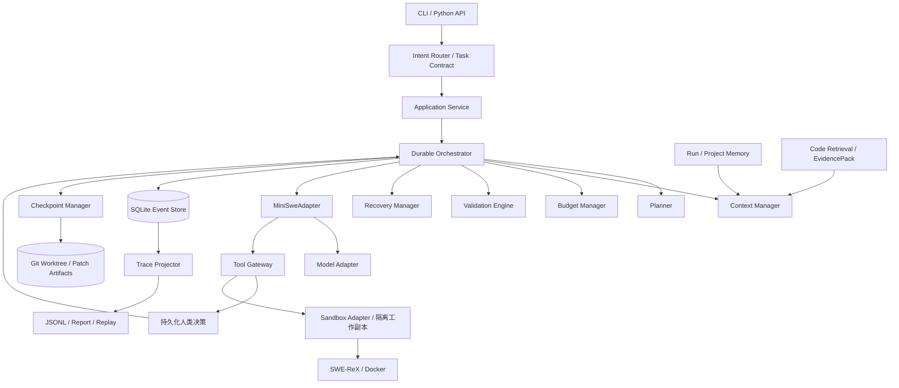
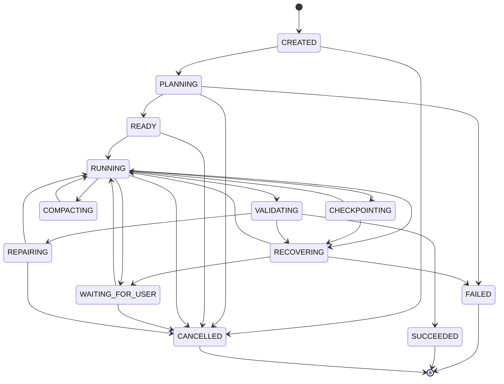

# 可恢复长程 Coding Agent Harness 详细开发设计

> 文档状态：设计基线（Design Baseline）
> 版本：0.2.0
> 日期：2026-09-19
> 当前阶段：已开始可靠性内核实现；完整 Agent、真实任务效果与整体验收尚未完成
> 暂定底座：mini-SWE-agent v2 + SWE-ReX/Docker
> 项目代号：`Horizon`（临时代号，后续可更名）

配套合同：[Agent 能力详细设计](agent-capabilities-design.md) · [逐项需求追踪矩阵](requirements-traceability.md)。

本版新增意图识别、Memory、Code RAG、结构化 Tool Calling、持久化 HITL、有界 Fallback 的具体设计；细化上下文、执行隔离与恢复边界。保留原 49 项要求，新增 30 项，共 79 项。文中接口仍是完整目标设计，不能按描述推定已实现；实际进度与证据见[开发记录](development-progress.md)。

2026-09-30 执行说明：默认由当前开发者直接实现并自检。下文 M0～M5 是技术依赖与历史追踪标签，不自动启动固定里程碑、角色编排或中央模型路由。关键风险及重要结论按需独立复核。

## 1. 项目定位

本项目是一个面向长程软件工程任务的可恢复 Coding Agent Harness，目标是让 Coding Agent 不仅能够“调用模型、修改文件、运行测试”，还能够在多阶段、长时间、可能被中断的真实任务中保持任务约束，保存进展，恢复执行，控制资源消耗，并生成可审计、可重放的完整执行证据。

项目对外的一句话定义：

> 面向长程软件工程任务的可恢复 Coding Agent Harness：支持任务分解、持久化检查点、进程崩溃恢复、上下文压缩、预算控制、验证闭环和可重放 Trace。

这里的“长程”不以单纯增加最大轮数定义，而以下列能力是否成立定义：

1. 任务能够被拆解为有依赖、有验收条件的工作项。
2. Agent 进程在任意受支持的故障点退出后，可以从持久化状态恢复。
3. 恢复后不会重复已经提交的不可重复副作用。
4. 上下文压缩不会丢失目标、约束、已接受决策、未解决失败和验证证据。
5. Token、费用、步骤、墙钟时间和工具调用均受到显式预算约束。
6. “模型声称完成”不等于任务完成；只有验证器通过验收条件后才能结束。
7. 每次运行都能导出足以解释决策、工具调用、状态迁移和失败原因的 Trace。

## 2. 设计状态与证据边界

本文件是开发合同和设计基线，不是完成证明。

- 已完成：需求定义、架构划分、核心数据模型、状态机、恢复协议、接口草案、测试策略、里程碑和验收标准设计。
- 已进入实现：可靠性内核、SiliconFlow adapter、Run/Campaign 双层模型预算、Typed Tool Gateway、Docker 受保护验证、顺序 WorkItem DAG 循环、一次显式且原子提交的受限执行期 replan、相同动作与精确 period-2 无进展保护、单/多文件精确写入恢复、含精确显式崩溃处置的受限单文件创建、最多 8 个总变更且至多 1 个新文件的 promotion 与确定性 ContextProjection；逐项边界见[开发记录](development-progress.md)。
- 已验证子范围：Fake Model 的成功/返修闭环、6 项真实 Docker 契约，以及一次真实 SiliconFlow + Docker fixture Run；这不是长程或 benchmark 结果。
- 未完成：完整底座 Spike、自然语言任务分解、自动触发或多次 replan、并行 WorkItem、任意副作用恢复、多文件新增、删除/重命名及其 promotion、Project Memory、symbol/vector RAG、精确 tokenizer/语义 Context、通用 HITL、retry/breaker/fallback、SWE-bench 实验和整体验收；当前已有 deterministic dependency-ready 顺序调度、一次显式受限 replan、版本化保守 input-token 上界、revision-aware 词法 RAG 与证据驱动的 run-scope Memory 子范围，均未形成真实任务效果结论。
- 文中的阈值属于计划验收标准，不代表已经达到。
- mini-SWE-agent 的适配接口必须通过 M0 Spike 后冻结；当前设计不承诺未经验证的上游内部 API 稳定性。
- 后续如需变更强制需求，必须记录 ADR，并同步更新需求追踪矩阵。

本次 0.2.0 的设计依据、模块和新增验收规则见配套文档。旧文中“核心循环复用”“执行分叉是否首版必做”“仅用事件恢复文件”的歧义在本版具体化，不削减原 FR 要求。

## 3. 目标、非目标与成功定义

### 3.1 产品目标

- 输入一个结构化软件工程任务或 GitHub Issue 描述。
- 在隔离工作区中完成检索、规划、编辑、测试和修复循环。
- 支持主动取消、等待人工、预算耗尽、失败终止和成功终止。
- 进程崩溃后，通过事件日志和检查点恢复任务。
- 输出代码补丁、验证报告、运行摘要和完整 Trace。
- 用固定、可复现的小型真实任务集比较原始底座与新增机制。

### 3.2 学习与求职目标

项目最终应让候选人能够独立解释并现场演示：

- Agent Loop 与普通 Workflow 的区别。
- 为什么长上下文不等于长程可靠性。
- 如何设计可恢复状态机和 append-only 事件日志。
- 如何处理至少一次执行带来的重复副作用风险。
- 如何做上下文压缩并验证关键事实未丢失。
- 如何定义预算、故障分类、重试和终止条件。
- 如何用真实可执行测试而不是仅用 LLM Judge 验证 Coding Agent。
- 如何从 Trace 定位一次失败并重放关键步骤。

### 3.3 非目标

首个可验收版本明确不包含：

- 通用桌面 IDE 或完整 VS Code 插件。
- 多租户 SaaS、计费系统和企业 RBAC。
- 任意数量 Agent 的自由协作或角色扮演式 Multi-Agent。
- 自动合并 PR、自动部署生产环境。
- 自研大模型或模型微调。
- 对完整 SWE-bench 排行榜作性能承诺。
- 用 UI 包装替代可靠性内核。
- 把所有 Shell 命令设计成独立 MCP Tool。

### 3.4 工程成功定义

只有同时满足以下条件，工程版本才可标记为通过：

1. 需求追踪矩阵中所有强制项均有实现位置与实际测试证据；关键风险、重要结论及用户指定验收另有独立复核结论。
2. 至少一个真实仓库任务能够从创建运行到生成补丁与验证报告。
3. 故障注入测试证明受支持故障点可以恢复。
4. 恢复后不存在由 Harness 造成的重复提交或重复状态迁移。
5. Trace 能离线还原状态迁移、模型调用元数据、工具调用和验证结果。
6. 固定 mini benchmark 的基线与实验组均完成运行，失败样本也被保留和分类。
7. 一键复现实验入口、环境说明和已知限制齐备。

## 4. 底座选择与所有权边界

### 4.1 暂定底座

采用 mini-SWE-agent v2 作为最小 Agent Loop，采用 SWE-ReX 或 Docker 作为隔离执行后端。

当前调研所见 mini-SWE-agent v2 的核心协议包括：

- `Model.query()`：根据消息历史请求模型。
- `Model.format_message()` 与 `format_observation_messages()`：处理模型和观察消息。
- `Environment.execute()`：执行模型动作。
- `Agent.run()`：运行任务。
- `Agent.save()`：输出轨迹数据。

实现时不得让上游对象直接渗透到领域层。所有上游调用必须经过 `MiniSweAdapter` 和 `SandboxAdapter`。

上游默认工具面为 bash；Horizon 的多工具与恢复边界需要自研单步适配。基线保留上游 `run()`，Horizon 由 Orchestrator 控制 query/dispatch 两个阶段，不能直接嵌套不可控的上游 run/step 循环。具体扩展职责见配套文档第 2、7 节。

### 4.2 复用与自研边界

| 能力 | 处理方式 | 项目贡献归属 |
|---|---|---|
| 基础模型组件与最小循环范式 | 复用 mini-SWE-agent；Horizon 单步编排自行适配 | 上游与本项目边界分别标注 |
| 本地/容器命令执行 | 复用 SWE-ReX/Docker | 上游能力 |
| 任务合同与验收条件 | 自研 | 本项目核心 |
| 工作项 DAG 与调度 | 自研 | 本项目核心 |
| 持久化事件日志 | 自研 | 本项目核心 |
| 检查点与恢复协议 | 自研 | 本项目核心 |
| 上下文压缩与事实保留 | 自研 | 本项目核心 |
| 预算账本与统一终止 | 自研 | 本项目核心 |
| 验证闭环 | 自研 | 本项目核心 |
| Trace 规范、查询与重放 | 自研 | 本项目核心 |
| 故障注入与实验框架 | 自研 | 本项目核心 |
| 意图、Memory、Code RAG、Tool Gateway、HITL、Fallback | 自研受控服务；详见配套文档 | 本项目核心 |
| SWE-bench 数据与官方判定 | 复用 | 外部评测基础设施 |

### 4.3 依赖策略

- M0 结束时以精确版本或 commit SHA 固定 mini-SWE-agent 和 SWE-ReX。
- 领域核心（`domain/` 及纯规则服务）不允许导入 `minisweagent.*` 或 `swerex.*`；上游依赖限定在 `adapters/`。
- 第三方异常必须在 adapter 层转换为项目内部错误码。
- 上游 trajectory 仅作为原始证据保存，不能作为本项目唯一持久化状态。
- 如上游升级导致契约测试失败，默认阻止升级，而不是静默兼容。

## 5. 核心用户故事

### US-01：运行真实 Issue

用户提交仓库、基准提交、Issue 描述、验收命令和预算。系统创建隔离工作区，规划并执行修改，输出补丁和验证报告。

### US-02：进程崩溃后恢复

Agent 在执行第 N 步后被强制终止。用户重新启动并执行 `resume`，系统识别最后一个一致检查点，完成对账并继续，而不是从头开始。

### US-03：上下文接近上限

系统在达到软阈值时生成结构化摘要，保留任务合同、计划、决策、失败、文件变更和验证证据，并在压缩后继续执行。

### US-04：预算终止

当费用、Token、步骤或时间达到硬上限，系统停止发起新动作，持久化终止事件，保留当前工作区和补丁，并给出明确原因。

### US-05：验证失败后返修

模型提交候选结果后，验证器运行约定命令。若失败，系统把结构化失败报告加入后续上下文并进入有限返修；超过返修预算则失败终止。

### US-06：离线审计和重放

用户无需再次调用模型，即可查看某次运行的状态迁移、命令、输出摘要、资源消耗和验证结果；在允许的情况下可从检查点创建 fork 进行对照实验。

## 6. 功能需求

### 6.1 任务与计划

- **FR-001**：系统必须接受结构化 `TaskSpec`，至少包含任务描述、仓库来源、基准版本、验收条件和预算。
- **FR-002**：系统必须把任务拆分为 1 个或多个 `WorkItem`，每项包含目标、依赖、预期产物和验收条件。
- **FR-003**：工作项依赖必须构成有向无环图；检测到环时拒绝启动。
- **FR-004**：计划修改必须产生版本号和 `PLAN_REVISED` 事件，禁止无记录覆盖。
- **FR-005**：只有依赖项通过的工作项才可进入执行状态。

### 6.2 持久化与恢复

- **FR-101**：所有影响恢复的状态变化必须先写入 append-only 事件日志。
- **FR-102**：每个 Agent Step 结束后必须存在可恢复边界。
- **FR-103**：系统必须支持显式检查点和策略触发检查点。
- **FR-104**：进程重启时必须从数据库重建权威状态，而不是相信内存缓存。
- **FR-105**：恢复流程必须识别未完成的模型调用、工具调用和验证运行。
- **FR-106**：恢复后必须对工作区 HEAD、dirty diff、检查点摘要和数据库记录执行一致性检查。
- **FR-107**：不确定是否已完成的有副作用操作不得自动重放，必须查询结果或进入人工确认。

### 6.3 上下文管理

- **FR-201**：系统必须将上下文划分为不可压缩区、结构化记忆区、近期事件区和可丢弃原始输出区。
- **FR-202**：压缩前后必须验证关键事实集合完整。
- **FR-203**：每次压缩必须记录覆盖的事件范围、摘要模型、输入/输出 Token 和事实校验结果。
- **FR-204**：原始事件永不因压缩被删除；压缩只改变后续模型上下文投影。
- **FR-205**：当压缩失败或摘要不满足事实校验时，系统必须保持旧上下文并执行安全终止或降级。

### 6.4 预算控制

- **FR-301**：系统必须支持 Token、费用、模型调用、Agent Step、工具调用、返修次数和墙钟时间预算。
- **FR-302**：每项预算必须区分软阈值和硬上限。
- **FR-303**：超出软阈值时触发压缩、计划重估或降级事件；硬上限阻止新动作。
- **FR-304**：预算账本必须能够从持久事件重建。
- **FR-305**：未知费用不能按 0 处理，必须标记为 `unknown` 并按配置决定是否允许继续。

### 6.5 验证闭环

- **FR-401**：工作项和任务都必须具有机器可执行或机器可判定的验收条件。
- **FR-402**：模型的完成声明只能触发验证，不能直接进入成功状态。
- **FR-403**：验证器必须记录命令、退出码、持续时间、标准输出/错误摘要和产物地址。
- **FR-404**：验证失败必须被归类并反馈给返修循环。
- **FR-405**：达到返修上限后必须保留最后补丁与失败证据并失败终止。
- **FR-406**：任务级成功要求所有强制工作项通过且最终验证通过。

### 6.6 Trace 与重放

- **FR-501**：每个事件必须具有全局唯一 ID、Run ID、单调序号、时间、类型、因果父事件和 Schema 版本。
- **FR-502**：模型调用必须记录模型标识、参数摘要、Token/费用、延迟、请求关联 ID 和结果状态；密钥不得进入 Trace。
- **FR-503**：工具调用必须记录规范化参数摘要、授权结果、开始/结束事件、退出状态和输出引用。
- **FR-504**：系统必须支持将 Trace 导出为 JSONL。
- **FR-505**：离线重放必须在不调用模型、不执行命令的前提下重建状态视图。
- **FR-506**：执行重放必须创建新 Run，不得修改原 Run。

### 6.7 安全、控制与产物

- **FR-601**：默认执行环境必须是隔离容器，而不是宿主机 Shell。
- **FR-602**：命令必须具有超时、输出上限和工作目录边界。
- **FR-603**：用户必须能够取消运行；取消后不得启动新模型或工具调用。
- **FR-604**：高风险或未分类副作用必须进入人工确认状态。
- **FR-605**：每次终止必须生成 `RunSummary`，包括补丁、验证、预算、失败分类和 Trace 地址。

### 6.8 Agent 能力增量

新增 FR-701～704、FR-801～804、FR-901～904、FR-1001～1005、FR-1101～1104、FR-1201～1204、FR-1301～1305，逐条定义于[配套文档第 15 节](agent-capabilities-design.md#15-新增强制需求)。它们与本节原要求一同验收；向量检索、reranker、MCP、多 Agent 为可选扩展。

## 7. 非功能需求

- **NFR-001 可恢复性**：规定故障注入点上的恢复测试必须全部通过，具体集合在测试章节定义。
- **NFR-002 一致性**：数据库中的同一 Run 事件序号不得重复或跳过已提交事件。
- **NFR-003 幂等性**：同一幂等键的 Harness 管理操作至多产生一个已提交结果。
- **NFR-004 可审计性**：所有状态迁移均可追溯到触发事件。
- **NFR-005 可移植性**：开发环境支持 Windows 主机 + Linux Docker；核心运行环境以 Linux 容器为准。
- **NFR-006 可测试性**：模型和 Sandbox 必须可替换为确定性 Fake。
- **NFR-007 可扩展性**：新增模型或执行后端不得修改领域状态机。
- **NFR-008 隐私**：默认不在日志中记录 API Key、完整环境变量或未经允许的仓库外文件。
- **NFR-009 可复现性**：实验必须记录代码 commit、依赖锁、模型配置、TaskSpec 和随机种子（若适用）。
- **NFR-010 性能边界**：首版优先保证正确性；不承诺高并发，只要求单机至少支持顺序批量评测。

## 8. 总体架构



采用 Plan–Execute–Verify 外循环和工作项内 ReAct；Harness 统一管理意图、上下文、权限、预算、Gateway 与恢复。新增模块的职责、数据流和文件路径见[Agent 能力设计](agent-capabilities-design.md)。

### 8.1 分层规则

1. `domain` 只包含业务实体、状态机、事件类型和纯规则。
2. `application` 编排用例和事务，不直接调用第三方库。
3. `adapters` 包装 mini-SWE-agent、模型、SWE-ReX、Git 和 SQLite。
4. `interfaces` 提供 CLI 和未来可选的 HTTP API。
5. 依赖方向必须指向内层；领域层禁止引用外层。

### 8.2 单 Agent 原则

首版采用单执行 Agent + 确定性服务，而不是多个 LLM Agent：

- Planner 可以由模型辅助，但必须输出结构化计划并经过 Schema 校验。
- Validator 是程序服务，不是一个“Reviewer 人设”。
- Recovery Manager 依据错误分类表运行，不依赖角色扮演。
- 如未来引入 Reviewer Agent，必须作为独立可消融实验，而不是默认正确性来源。

## 9. 建议代码目录

```text
coding-agent/
├── pyproject.toml
├── uv.lock
├── README.md
├── LICENSE
├── configs/
│   ├── default.yaml
│   ├── models/
│   ├── policies/
│   └── benchmarks/
├── src/horizon/
│   ├── domain/
│   │   ├── task.py
│   │   ├── work_item.py
│   │   ├── run.py
│   │   ├── events.py
│   │   ├── states.py
│   │   ├── budget.py
│   │   ├── checkpoint.py
│   │   ├── validation.py
│   │   └── errors.py
│   ├── application/
│   │   ├── create_task.py
│   │   ├── execute_run.py
│   │   ├── resume_run.py
│   │   ├── cancel_run.py
│   │   ├── replay_run.py
│   │   └── services.py
│   ├── orchestration/
│   │   ├── state_machine.py
│   │   ├── planner.py
│   │   ├── scheduler.py
│   │   ├── recovery.py
│   │   └── policies.py
│   ├── context/
│   │   ├── projector.py
│   │   ├── compactor.py
│   │   ├── fact_ledger.py
│   │   └── token_estimator.py
│   ├── validation/
│   │   ├── engine.py
│   │   ├── checks.py
│   │   └── reporters.py
│   ├── trace/
│   │   ├── schema.py
│   │   ├── projector.py
│   │   ├── exporter.py
│   │   └── replay.py
│   ├── adapters/
│   │   ├── miniswe/
│   │   │   ├── agent.py
│   │   │   ├── model.py
│   │   │   └── trajectory.py
│   │   ├── sandbox/
│   │   │   ├── base.py
│   │   │   ├── swerex.py
│   │   │   └── fake.py
│   │   ├── persistence/
│   │   │   ├── sqlite.py
│   │   │   ├── migrations/
│   │   │   └── repositories.py
│   │   └── vcs/
│   │       ├── git.py
│   │       └── fake.py
│   ├── interfaces/
│   │   └── cli/
│   │       ├── app.py
│   │       ├── run.py
│   │       ├── resume.py
│   │       ├── status.py
│   │       ├── trace.py
│   │       └── eval.py
│   └── config.py
├── tests/
│   ├── unit/
│   ├── contract/
│   ├── integration/
│   ├── e2e/
│   ├── fault_injection/
│   └── fixtures/
├── benchmarks/
│   ├── manifests/
│   ├── runner/
│   ├── reports/
│   └── analysis/
├── docs/
│   ├── architecture/
│   ├── operations/
│   ├── evaluation/
│   └── adr/
└── artifacts/                 # 默认 gitignore
    ├── runs/
    ├── checkpoints/
    └── reports/
```

## 10. 领域模型

上方是设计时目录；意图、Memory、RAG、工具网关、HITL、Fallback 及提示词的目标边界见配套文档第 11 节。当前实现按最小内聚模块落在 `application/context.py`、`adapters/retrieval/sqlite_fts.py`、`tools/gateway.py`、`application/tool_recovery.py` 和 `adapters/workspace/promotion.py` 等位置；其余仍是未来目标，权威状态见开发记录。

### 10.1 TaskSpec

`TaskSpec` 是不可变任务合同。创建 Run 后不得原地修改；变化必须生成新版本。

```yaml
schema_version: "1.0"
task_id: "task_01J..."
title: "Fix parser regression"
objective: "修复……并保持现有行为"
repository:
  source: "local|git"
  url: null
  path: "/workspace/repo"
  base_commit: "<40-char-sha>"
constraints:
  allowed_paths: ["src/**", "tests/**"]
  denied_paths: [".git/**", "secrets/**"]
  allowed_tools: ["retrieve_code", "read_file", "replace_text"] # 可选；只能收窄 execution_mode
  network: "deny"
acceptance:
  - id: "accept_unit"
    kind: "command"
    command: "pytest -q tests/test_parser.py"
    timeout_seconds: 300
    required: true
budgets:
  max_steps: 80
  max_model_calls: 80
  max_tool_calls: 240
  max_wall_time_seconds: 7200
  max_cost_usd: 10.0
  max_repair_cycles: 4
```

### 10.2 WorkItem

| 字段 | 含义 |
|---|---|
| `work_item_id` | 稳定 ID |
| `plan_version` | 所属计划版本 |
| `title` / `objective` | 局部目标 |
| `dependencies` | 前置工作项 ID |
| `expected_artifacts` | 预期文件、补丁或报告 |
| `acceptance_ids` | 对应验收条件 |
| `status` | 当前状态 |
| `attempt` | 当前尝试次数 |
| `assigned_budget` | 从总预算分配的局部预算 |

### 10.3 Run

一次 `Run` 是对某个 TaskSpec 版本的一次独立执行。恢复仍属于同一 Run；从历史点分叉属于新 Run，并记录 `forked_from_run_id` 和 `forked_from_event_id`。

Run 必须持久化精确 `spec_version`、`lease_epoch`、墙钟 `deadline_at` 和等待前的 `resume_state`；resume 不重置预算。TaskSpec 修订保留历史并重新检查受影响验收。

### 10.4 Event

事件是恢复、审计和投影的唯一权威输入。领域状态是事件的投影，不是另一套独立真相。

### 10.5 Checkpoint

检查点由以下内容共同组成：

- 已提交事件序号。
- 任务、计划、预算和上下文投影版本。
- 工作区基准 commit。
- 当前 Git HEAD（若采用临时提交策略）。
- dirty patch 或内容寻址快照。
- 未跟踪文件清单与摘要。
- Sandbox 身份与可重建配置。
- 完整性校验值。

### 10.6 ValidationReport

验证报告必须区分：

- `passed`：所有必需检查通过。
- `failed`：检查已运行且至少一个必需检查失败。
- `errored`：验证基础设施自身失败，不能等同于代码失败。
- `skipped`：因合同允许的条件跳过。
- `unknown`：没有足够证据判断，不能当作通过。

## 11. 状态机

### 11.1 Run 状态



### 11.2 状态不变量

- 终态只有 `SUCCEEDED`、`FAILED`、`CANCELLED`。
- `SUCCEEDED` 前必须存在通过的任务级 `ValidationReport`。
- `RUNNING` 同一时刻最多有一个持有有效 Lease 的 Worker。
- `CHECKPOINT_COMMITTED` 必须引用已经提交的最大事件序号。
- `BUDGET_HARD_LIMIT_REACHED` 后不得出现新的 `MODEL_CALL_STARTED` 或 `TOOL_CALL_STARTED`。
- `CANCEL_REQUESTED` 后允许结束正在进行且不可安全中断的动作，但不得启动新动作。
- 未知副作用状态只能进入 `WAITING_FOR_USER` 或 `FAILED`，不能静默重试。

图中展示主要路径；完整转换合同还包括：每个非终态均可因取消进入 CANCELLED、因错误/硬截止进入 FAILED；PLANNING/READY/COMPACTING/VALIDATING/CHECKPOINTING/REPAIRING 均可在需要时进入 WAITING_FOR_USER 或 RECOVERING。等待态和恢复态持久化 `resume_state`，回转前重新校验阶段前置条件，不无条件转 RUNNING。未列出的任意转换禁止。

### 11.3 WorkItem 状态

```text
PENDING -> READY -> RUNNING -> VALIDATING -> PASSED
                     |            |
                     |            +-> NEEDS_REPAIR -> READY
                     +-> BLOCKED
                     +-> FAILED
PENDING/READY/RUNNING/BLOCKED -> CANCELLED
```

## 12. 端到端执行流程

1. CLI 读取并校验 TaskSpec。
2. 系统解析仓库并固定 `base_commit`。
3. 创建 Run、事件流、Sandbox 与初始检查点。
4. Planner 输出结构化 WorkItem DAG。
5. 系统执行 Schema、环检测和预算可行性校验。
6. Scheduler 选择首个 READY 工作项。
7. Context Projector 组装本步模型上下文。
8. Budget Manager 预留模型调用预算。
9. MiniSweAdapter 调用模型并解析动作。
10. Policy Engine 对动作进行路径、权限和副作用分类。
11. Sandbox 执行动作，结果写入事件与 Artifact Store。
12. 更新预算账本和工作区变更摘要。
13. 在 Step 边界提交恢复点；策略满足时生成完整检查点。
14. 工作项宣称完成后运行工作项验证。
15. 失败则进入有限返修，成功则调度下一个工作项。
16. 所有工作项通过后运行任务级最终验证。
17. 生成补丁、RunSummary、ValidationReport 和 Trace Bundle。

## 13. 持久化设计

### 13.1 存储选择

首版使用 SQLite，原因是：

- 单机项目无需引入外部数据库。
- 事务能够把事件追加、幂等记录和投影游标原子提交。
- WAL 模式适合一个写入者和多个读取者。
- 文件便于演示、归档和复现实验。

SQLite 不承担大型二进制产物。完整命令输出、补丁、工作区归档等写入 Artifact Store，数据库只保存 URI、摘要和大小。

### 13.2 数据表

#### `tasks`

| 列 | 类型 | 约束 |
|---|---|---|
| `task_id` | TEXT | PK |
| `title` | TEXT | 非空 |
| `created_at` | TEXT | ISO-8601 |

#### `task_specs`

| 列 | 类型 | 约束 |
|---|---|---|
| `task_id` | TEXT | FK tasks；联合 PK |
| `spec_version` | INTEGER | 联合 PK |
| `spec_json` | TEXT | 非空 |
| `spec_sha256` | TEXT | 非空 |
| `created_at` | TEXT | ISO-8601 |

#### `runs`

| 列 | 类型 | 约束 |
|---|---|---|
| `run_id` | TEXT | PK |
| `task_id` | TEXT | FK |
| `spec_version` | INTEGER | 与 task_id 联合 FK 到 task_specs |
| `status` | TEXT | 非空 |
| `worker_lease_id` | TEXT | 可空 |
| `lease_epoch` | INTEGER | 非空，接管递增，用于 fencing |
| `lease_expires_at` | TEXT | 可空 |
| `resume_state` | TEXT | 等待/恢复前合法阶段，可空 |
| `deadline_at` | TEXT | 墙钟硬截止；恢复不重置 |
| `last_event_seq` | INTEGER | 非空 |
| `last_checkpoint_id` | TEXT | 可空 |
| `forked_from_run_id` | TEXT | 可空 |
| `created_at` / `updated_at` | TEXT | 非空 |

#### `events`

| 列 | 类型 | 约束 |
|---|---|---|
| `event_id` | TEXT | PK |
| `run_id` | TEXT | FK |
| `seq` | INTEGER | `UNIQUE(run_id, seq)` |
| `event_type` | TEXT | 非空 |
| `schema_version` | INTEGER | 非空 |
| `causation_id` | TEXT | 可空 |
| `correlation_id` | TEXT | 可空 |
| `payload_json` | TEXT | 非空 |
| `created_at` | TEXT | 非空 |

#### `idempotency_records`

| 列 | 类型 | 约束 |
|---|---|---|
| `scope` | TEXT | 联合主键 |
| `idempotency_key` | TEXT | 联合主键 |
| `operation_type` | TEXT | 非空 |
| `status` | TEXT | `started|committed|unknown|failed` |
| `result_ref` | TEXT | 可空 |
| `updated_at` | TEXT | 非空 |

#### `checkpoints`

| 列 | 类型 | 约束 |
|---|---|---|
| `checkpoint_id` | TEXT | PK |
| `run_id` | TEXT | FK |
| `event_seq` | INTEGER | 非空 |
| `manifest_uri` | TEXT | 非空 |
| `manifest_sha256` | TEXT | 非空 |
| `status` | TEXT | `preparing|committed|invalid` |
| `created_at` | TEXT | 非空 |

#### `artifacts`

| 列 | 类型 | 约束 |
|---|---|---|
| `artifact_id` | TEXT | PK |
| `run_id` | TEXT | FK |
| `kind` | TEXT | 非空 |
| `uri` | TEXT | 非空 |
| `sha256` | TEXT | 非空 |
| `size_bytes` | INTEGER | 非空 |
| `redaction_state` | TEXT | 非空 |

#### `projection_offsets`

保存各投影器消费到的事件序号，使状态视图可以删除后从事件流重建。

Memory、代码索引、Context、工具调用、HITL、provider health 和 admission 的增量表及事务规则见配套文档第 11 节。索引是派生数据，不能取代权威事件。

### 13.3 事务原则

- 事件序号分配与事件插入必须处于同一写事务。
- 事件追加成功后才允许更新 Run 快照字段。
- Artifact 必须先写临时文件、计算摘要并原子重命名，再追加引用事件。
- 不允许先修改 `runs.status` 再补事件。
- 读取状态时，如快照的 `last_event_seq` 落后，必须通过事件追平。

## 14. 检查点协议

### 14.1 触发条件

- Run 初始工作区准备完成。
- 每个 WorkItem 通过。
- 每 N 个 Agent Step。
- 上下文压缩之前。
- 高风险工具调用之前。
- 用户请求暂停时。
- 最终验证之前和运行终止时。

### 14.2 两阶段提交

1. 追加 `CHECKPOINT_PREPARE_STARTED`。
2. 冻结调度，不再启动新动作；等待/终止在途写进程并确认静止，无法静止则不得提交一致检查点。
3. 收集领域投影、预算账本和上下文索引。
4. 记录 Git HEAD、dirty patch、未跟踪文件和工作区摘要。
5. 写入临时 manifest 与 Artifact。
6. 校验所有摘要和引用可读性。
7. 在一个数据库事务中写 `checkpoints(status=committed)`、追加 `CHECKPOINT_COMMITTED` 并更新 Run 的 `last_checkpoint_id`。
8. 提交后刷新内存缓存；manifest 的 event_seq 表示所覆盖的已提交状态序号，后续从该序号之后投影事件。
9. 清理未被引用的临时文件可延后执行；清理失败不影响已提交检查点。

这里是“准备产物 + 事务提交引用”的应用协议，不是跨文件系统/SQLite 的分布式 2PC。每个已接纳写动作都保存 patch/文件 Artifact 和前后树 hash，定期完整 checkpoint 仅缩短恢复链；事件重放不能替代文件恢复。

### 14.3 Manifest 示例

```json
{
  "schema_version": 1,
  "checkpoint_id": "chk_01J...",
  "run_id": "run_01J...",
  "event_seq": 142,
  "task_spec_sha256": "...",
  "plan_version": 3,
  "budget_ledger_seq": 142,
  "context_snapshot_id": "ctx_01J...",
  "workspace": {
    "base_commit": "...",
    "head_commit": "...",
    "patch_artifact_id": "art_...",
    "untracked_manifest_artifact_id": "art_..."
  },
  "pending_operations": [],
  "created_at": "2026-09-19T10:00:00Z"
}
```

## 15. 崩溃恢复协议

### 15.1 启动恢复

`resume(run_id)` 必须按以下顺序执行：

1. 获取带过期时间的 Worker Lease；已有有效 Lease 时拒绝双重恢复。
2. 读取最后一个已提交检查点。
3. 验证 manifest 摘要、TaskSpec 和依赖版本。
4. 重建或重新连接 Sandbox。
5. 先保全现有副本和悬空动作证据；在新工作区恢复 snapshot 与后续已接纳 patch 链，逐步比较 base commit、HEAD、diff、未跟踪文件及前后树 hash。
6. 从检查点事件序号向后重放已提交事件。
7. 检查 `STARTED` 而无对应终止事件的操作。
8. 对每个悬空操作执行恢复决策。
9. 追加 `RECOVERY_RECONCILED` 和恢复报告。
10. 只有一致性检查通过后才能进入 `RUNNING`。

Lease TTL 过期后必须增加 epoch、fence 旧 Worker，确认旧命令不能继续写入再接管。挂起审批、记忆有效性和检索 revision 一并恢复；不确定状态不得通过降低检查强行续行。

### 15.2 悬空操作决策表

| 操作 | 恢复策略 |
|---|---|
| 只读工具调用 | 可按策略重试，并使用新 attempt ID |
| 文件编辑 | 先检查文件摘要或 patch 是否已经存在，再决定跳过或重试 |
| 测试命令 | 可重跑；旧进程必须确认已终止 |
| 模型调用 | 不假设供应商已执行；如无可查询请求 ID，标记旧调用 `unknown` 后发起新调用 |
| Git 临时提交 | 通过 commit ID 查询，不重复提交 |
| 外部 PR/Issue 写操作 | 必须通过外部 ID 查询；无法确认则等待人工 |
| Checkpoint 写入 | 只接受 committed 记录；preparing 记录视为未提交并隔离 |

### 15.3 恢复保证

首版承诺的是：

- Harness 内部状态使用事务和幂等键实现“效果至多一次”。
- 对可查询外部副作用，通过外部结果对账避免重复。
- 对不可查询副作用不声称 exactly-once；进入人工确认或失败终止。

## 16. 上下文管理与压缩

### 16.1 上下文分层

#### A. 不可压缩区

- TaskSpec 的目标、约束和验收条件。
- 当前计划及依赖。
- 当前 WorkItem。
- 安全策略和权限。
- 硬预算剩余值。

#### B. 结构化事实账本

- 已确认的仓库事实。
- 已修改文件及原因。
- 已执行验证与结果。
- 已接受/拒绝的方案。
- 当前阻塞和未解决错误。
- 关键符号、文件和命令引用。

#### C. 近期窗口

- 最近 K 个模型、动作和观察事件。

#### D. 可压缩历史

- 早期推理文本。
- 重复命令输出。
- 大型日志正文。
- 已被 Artifact 引用的完整文件内容。

### 16.2 压缩触发

- 估算上下文达到模型上限的 70%：软触发。
- 达到 85%：强制压缩，压缩完成前不再调用主模型。
- WorkItem 切换时可触发阶段摘要。
- 超长工具输出立即外置为 Artifact，只把摘要和引用进入上下文。

百分比是初始配置，不是已验证最优值，必须在评测中记录并可调整。

### 16.3 Fact Ledger

每条关键事实包含：

```json
{
  "fact_id": "fact_01J...",
  "category": "constraint|decision|change|failure|validation|open_question",
  "statement": "parser.py 的公开 API 不允许改名",
  "source_event_ids": ["evt_..."],
  "status": "active|superseded|resolved",
  "confidence": "observed|inferred|model_claim",
  "supersedes": null
}
```

压缩器不能把 `model_claim` 自动提升为 `observed`。

### 16.4 压缩后校验

程序化校验至少确认：

- 所有 required acceptance IDs 仍存在。
- 所有 active constraints 仍存在。
- 当前 WorkItem、计划版本和剩余预算匹配。
- 未解决失败和 open questions 未丢失。
- 所有摘要引用的事件和 Artifact 存在。
- 摘要覆盖范围连续且无重叠歧义。

0.2.0 进一步要求 mandatory 字段精确复制并比较内容 hash；只检查 ID 存在不足以证明要求未改写。六层 ContextPack、Token 预算、工具消息配对和摘要语义评测见配套文档第 4 节；Run/Project Memory 与 Code RAG 见第 5～6 节。

## 17. 预算系统

### 17.1 BudgetSpec

```python
class BudgetSpec:
    max_input_tokens: int | None
    max_output_tokens: int | None
    max_cost_usd: Decimal | None
    max_model_calls: int | None
    max_tool_calls: int | None
    max_steps: int | None
    max_wall_time_seconds: int | None
    max_repair_cycles: int
```

每项预算还包含 `soft_ratio`。默认建议值为 0.8，具体值由配置和实验决定。

### 17.2 预留—结算

模型或工具调用前先创建预算预留：

1. 根据最大输出、超时和估算费用申请 reservation。
2. 无法预留则不启动调用。
3. 调用结束后用真实使用量结算。
4. 调用状态未知时保留保守占用，直到人工或供应商对账。

意图分类、规划、摘要、重试、fallback 探测都纳入账本；墙钟时间包含等待与停机，resume 不重置。模型更换和预算增加遵循预授权或显式合同修订，不能隐式扩大。

### 17.3 预算终止优先级

1. 安全策略拒绝。
2. 用户取消。
3. 硬预算。
4. TaskSpec 验收成功。
5. Agent 自主完成声明。

Agent 自主声明的优先级最低，只能触发验证。

## 18. 验证闭环

### 18.1 验证层级

1. **结构验证**：TaskSpec、计划、动作参数和产物 Schema。
2. **静态验证**：格式、lint、类型检查、路径策略。
3. **目标测试**：与当前 WorkItem 直接相关的测试。
4. **回归测试**：TaskSpec 中声明的测试集。
5. **补丁验证**：diff 非空、允许路径、无秘密和无意外大文件。
6. **任务级验收**：所有 required acceptance 条件。

### 18.2 Repair Loop

```text
candidate patch
    -> deterministic validation
    -> pass: work item/task accepted
    -> fail: structured failure report
         -> remaining repair budget?
             -> yes: new repair attempt
             -> no: failed with retained evidence
```

返修输入必须包含：

- 失败检查 ID。
- 退出码和精简错误摘要。
- 完整日志 Artifact 引用。
- 与上次候选 patch 的差异。
- 剩余预算和剩余返修次数。

### 18.3 不使用单一 LLM Judge 作为成功标准

LLM Judge 可作为补充分析，但不能替代：

- 可执行测试。
- 编译/类型检查。
- TaskSpec 明确的结构约束。
- SWE-bench 官方测试判定。

## 19. Trace 设计

### 19.1 事件信封

```json
{
  "schema_version": 1,
  "event_id": "evt_01J...",
  "run_id": "run_01J...",
  "seq": 143,
  "event_type": "TOOL_CALL_FINISHED",
  "occurred_at": "2026-09-19T10:00:00.123Z",
  "causation_id": "evt_...",
  "correlation_id": "step_17",
  "actor": "orchestrator|agent|model|tool|validator|user",
  "payload": {},
  "redaction": {
    "applied": true,
    "ruleset_version": "1"
  }
}
```

### 19.2 最小事件集合

- `RUN_CREATED`
- `PLAN_CREATED`, `PLAN_REVISED`
- `WORK_ITEM_READY`, `WORK_ITEM_STARTED`, `WORK_ITEM_FINISHED`
- `STEP_STARTED`, `STEP_FINISHED`
- `MODEL_CALL_STARTED`, `MODEL_CALL_FINISHED`, `MODEL_CALL_FAILED`
- `TOOL_CALL_AUTHORIZED`, `TOOL_CALL_STARTED`, `TOOL_CALL_FINISHED`, `TOOL_CALL_FAILED`
- `BUDGET_RESERVED`, `BUDGET_SETTLED`, `BUDGET_SOFT_LIMIT_REACHED`, `BUDGET_HARD_LIMIT_REACHED`
- `CONTEXT_COMPACTION_STARTED`, `CONTEXT_COMPACTION_FINISHED`, `CONTEXT_COMPACTION_REJECTED`
- `VALIDATION_STARTED`, `VALIDATION_FINISHED`
- `CHECKPOINT_PREPARE_STARTED`, `CHECKPOINT_COMMITTED`
- `RECOVERY_STARTED`, `RECOVERY_RECONCILED`, `RECOVERY_BLOCKED`
- `CANCEL_REQUESTED`
- `RUN_SUCCEEDED`, `RUN_FAILED`, `RUN_CANCELLED`

### 19.3 输出脱敏与限流

- 命令输出正文默认写 Artifact，并设置大小上限。
- Trace 中只保存摘要、首尾片段、行数和 Artifact ID。
- 环境变量名可以记录，值默认不记录。
- 对疑似 Token、Key、密码和私钥执行脱敏。
- 脱敏规则版本必须进入事件信封。

### 19.4 两种重放

- **Projection Replay**：纯读取事件，重建状态、预算和时间线；不执行任何副作用。
- **Execution Fork**：从检查点复制工作区并创建新 Run，允许用不同策略继续；必须明确标记为实验分支。

首版必须实现 Projection Replay；Execution Fork 可安排在里程碑后半段。

按 FR-506，Execution Fork 纳入 M5 必需产物。它创建新 Run/工作区/预算并引用父 checkpoint；不是保证再次运行得到相同模型输出。

## 20. 工具执行、安全和权限

### 20.1 Sandbox 默认策略

- Linux 容器。
- 默认禁网；任务显式声明后才允许网络。
- 非 root 用户。
- 只挂载当前任务工作区和必要缓存。
- CPU、内存、进程数、磁盘和命令超时限制。
- 禁止挂载宿主 Docker Socket。
- 仓库外路径默认拒绝。

隔离容器不自动落实仓库内路径白名单。通用命令在一次性工作副本执行，Gateway 验证候选 patch 后才接纳到权威工作区；执行容器不可访问控制数据库、审批凭据和受保护验收定义。详细执行边界见配套文档第 7 节。

### 20.2 动作分类

| 等级 | 示例 | 默认策略 |
|---|---|---|
| `read_only` | 读文件、搜索、查看 Git 状态 | 自动允许 |
| `workspace_write` | 修改允许路径内文件 | 自动允许并记录 |
| `workspace_process` | 运行测试、编译 | 自动允许，受资源限制 |
| `network_read` | 下载文档、依赖 | TaskSpec 显式允许 |
| `external_write` | 发 Issue、推分支、开 PR | 首版人工确认 |
| `host_sensitive` | 访问宿主凭据、系统目录 | 拒绝 |

### 20.3 命令执行合同

每次执行必须包含：

- `command_id`
- `argv` 或明确的 shell 字符串
- `cwd`
- `timeout_seconds`
- `environment_allowlist`
- `output_limit_bytes`
- `idempotency_key`
- `risk_class`

## 21. 错误分类与恢复策略

| 分类 | 示例 | 是否自动重试 | 默认处理 |
|---|---|---:|---|
| `model_transient` | 429、5xx、网络中断 | 是 | 指数退避，受尝试预算限制 |
| `model_context_overflow` | 上下文超限 | 条件式 | 先压缩，再重试一次 |
| `model_auth` | 401、无效 Key | 否 | 失败并提示配置 |
| `tool_timeout` | 测试超时 | 条件式 | 终止旧进程，保存日志，按策略重试 |
| `tool_invalid_args` | 参数 Schema 错误 | 是 | 反馈给 Agent，计入 Step |
| `test_failure` | 断言失败 | 否 | 进入 Repair Loop，不算基础设施重试 |
| `sandbox_lost` | 容器退出 | 是 | 从检查点重建 Sandbox |
| `persistence_error` | SQLite 写失败 | 否 | 停止新动作，保护现有证据 |
| `policy_denied` | 越权路径 | 否 | 记录并反馈；重复触发可失败终止 |
| `unknown_side_effect` | 外部写入结果未知 | 否 | 等待人工或失败 |

重试次数不是隐藏常量，必须由 Policy 配置，并进入 Trace。

同一 Gateway 统一计数，禁止嵌套重试倍增。增加可持久化 Circuit Breaker；模型 fallback 默认关闭，启用时必须经过预授权、能力/隐私/预算兼容检查，保持原验收。具体决策表见配套文档第 9 节。

## 22. 对外接口

### 22.1 CLI 草案

```text
horizon task validate task.yaml
horizon run task.yaml --config configs/default.yaml
horizon status <run-id>
horizon resume <run-id>
horizon cancel <run-id>
horizon trace export <run-id> --format jsonl
horizon trace show <run-id>
horizon replay <run-id> --at <event-id>
horizon artifacts list <run-id>
horizon eval run benchmarks/manifests/mini.yaml
horizon eval report <eval-run-id>
```

### 22.2 Python 端口

```python
class AgentRuntimePort(Protocol):
    def next_action(self, context: AgentContext) -> AgentDecision: ...

class SandboxPort(Protocol):
    def execute(self, request: ToolRequest) -> ToolResult: ...
    def snapshot(self) -> WorkspaceSnapshot: ...
    def restore(self, snapshot: WorkspaceSnapshot) -> None: ...

class EventStorePort(Protocol):
    def append(self, run_id: str, expected_seq: int, events: list[Event]) -> int: ...
    def load(self, run_id: str, after_seq: int = 0) -> list[Event]: ...

class ArtifactStorePort(Protocol):
    def put(self, stream: BinaryIO, metadata: ArtifactMetadata) -> ArtifactRef: ...
    def get(self, artifact_id: str) -> BinaryIO: ...
```

### 22.3 暂不提供 HTTP API

首版先保证 CLI 和 Python API。只有状态机、恢复与 Trace 通过后，才考虑 FastAPI 查询接口或 Web 时间线；UI 不是前置验收条件。

## 23. 配置设计

配置优先级：CLI 显式参数 > 任务级配置 > 项目配置 > 默认配置。

```yaml
runtime:
  agent_adapter: miniswe
  sandbox: swerex_docker
  checkpoint_every_steps: 5
  lease_seconds: 60

model:
  provider: openai_compatible
  name: "<configured-model>"
  temperature: 0
  max_output_tokens: 8192

context:
  soft_ratio: 0.70
  hard_ratio: 0.85
  recent_event_window: 12

recovery:
  max_transient_retries: 3
  unknown_side_effect_policy: wait_for_user

validation:
  max_repair_cycles: 4

trace:
  artifact_output_limit_bytes: 10485760
  redact_secrets: true
```

配置加载完成后生成规范化快照和 SHA-256，写入 `RUN_CREATED`；运行期间不允许隐式漂移。

## 24. 测试策略

### 24.1 单元测试

- 状态迁移合法性与非法迁移拒绝。
- DAG 环检测和调度。
- 预算预留、结算、软硬上限。
- 错误分类表。
- Context Fact Ledger 合并与 supersede。
- Trace 脱敏。
- Checkpoint manifest 摘要。

### 24.2 契约测试

- `MiniSweAdapter` 对固定上游版本的接口契约。
- `SandboxPort` 的 Fake、Docker、SWE-ReX 一致行为。
- SQLite migration 向前升级和旧数据库读取。
- Artifact Store 原子写与摘要校验。

### 24.3 集成测试

- Fake Model + Fake Sandbox 的完整任务。
- Fake Model + Docker Sandbox 的文件修改与验证。
- SQLite 重启后的状态重建。
- 压缩前后关键事实一致。
- 取消和硬预算后无新调用。

### 24.4 故障注入矩阵

至少在下列位置执行强制进程退出：

1. `MODEL_CALL_STARTED` 之后、结果写入之前。
2. 工具执行完成之后、`TOOL_CALL_FINISHED` 写入之前。
3. 文件写入一半时。
4. Checkpoint 临时文件写完、数据库提交之前。
5. 数据库事务提交之后、内存或可重建投影缓存刷新之前（权威 Run 指针与 checkpoint/event 在同一事务内）。
6. Validation 命令运行期间。
7. Context compaction 结果生成后、事实校验之前。
8. Budget reservation 后、settlement 前。

每个故障点至少验证：

- 能否恢复或明确阻塞。
- 是否出现重复事件或重复副作用。
- 工作区与数据库是否一致。
- 预算是否保守且可解释。
- Trace 是否包含恢复决策。

可自动恢复的样本必须恢复并完成确定性任务；未知副作用或损坏证据才可明确阻塞。分别统计 auto_recovered/safely_blocked，不能把全部安全停止当作恢复成功。新增机制的交互故障测试见配套文档第 13 节。

### 24.5 端到端测试

首版至少包含三个自有固定仓库任务：

- 单文件缺陷修复。
- 跨文件重构并带回归测试。
- 需要两轮以上“实现—验证—返修”的任务。

端到端测试必须使用真实文件、Git、容器和命令验证；截图不构成通过证据。

## 25. 评测设计

### 25.1 研究问题

- RQ1：任务分解 + 验证闭环是否改变真实任务解决率和失败类型？
- RQ2：故障注入下，检查点恢复能否减少从头重跑及重复副作用？
- RQ3：上下文压缩在固定预算下如何影响成功率、成本和关键信息保留？
- RQ4：Trace 是否能提高故障定位的一致性和速度？

### 25.2 实验组

| 组 | 配置 |
|---|---|
| A | 原始 mini-SWE-agent 基线 |
| B | A + 结构化任务分解 + 验证闭环 |
| C | B + 事件日志 + Checkpoint + Recovery |
| D | C + Context Compaction + Budget Manager |

同一轮实验保持模型、参数、任务、容器镜像和预算一致。不得为单个失败样本临时修改提示词后仍计入同一实验。

B/C/D 使用相同 Horizon 工具与检索配置；A→B 同时改变工具面，整体差异不能单独归因于规划。另在 6 个预先固定的诊断样本上做 RAG、压缩、项目 Memory 的单变量关闭实验，详见配套文档第 13 节。

### 25.3 数据集

- 开发阶段：3 个自有确定性 fixture task。
- Mini benchmark：固定 20～30 个资源可承受的公开真实任务。
- 优先从 SWE-bench Verified 中固定抽取；具体任务清单、筛选规则和排除原因必须入库。
- 结果只能称为 “mini benchmark”，不能外推为完整 SWE-bench 表现。

在任务清单冻结时标注至少 6 个长程候选；任务效果、受控上下文压力和故障恢复分别报告。项目记忆按 instance/variant 隔离，gold tests/patch 不暴露给 Agent。

### 25.4 指标

- Task pass rate。
- Required checks pass rate。
- Crash recovery success rate。
- Duplicate side-effect count。
- Recovery 后额外步骤和额外费用。
- Tool call success rate。
- Repair success rate。
- 平均步骤、P95 步骤。
- 平均延迟、P95 延迟。
- 每任务 Token 与费用。
- Context compression 次数和事实保留率。
- 失败类别分布。
- Trace completeness。

### 25.5 验收与研究结果分离

工程验收要求机制正确运行，但不预设实验一定带来正向成功率提升：

- 必须报告所有自然结果，包括无提升或退化。
- 不得通过替换任务、修改随机种子、增加预算或删除失败样本制造提升。
- 性能差异必须同时报告任务级明细和成本变化。
- 样本量较小时不宣称统计显著性。

## 26. 计划验收阈值

以下均为后续工程验收目标，不是当前结果：

| 项目 | 计划阈值 |
|---|---:|
| 状态机合法/非法转换测试 | 100% 通过 |
| 固定故障注入点可恢复或明确阻塞 | 8/8 |
| Harness 导致的重复外部副作用 | 0 |
| 事件序号重复 | 0 |
| Checkpoint 摘要不一致漏检 | 0 |
| 硬预算后新启动调用 | 0 |
| 取消确认后新启动调用 | 0 |
| 固定 fixture 的 Trace 必需事件完整率 | 100% |
| 压缩后 required constraints/acceptance 保留率 | 100% |
| 三个本地 E2E fixture | 3/3 通过 |
| Mini benchmark 运行记录完整率 | 100% |

不对 mini benchmark 的 pass rate 预设“必须提升 X%”的验收门槛。

## 27. 里程碑

### M0：底座 Spike 与契约冻结

产出：

- 固定版本的 mini-SWE-agent/SWE-ReX 运行记录。
- 单个真实 Issue 的端到端基线。
- Adapter 契约测试草案。
- ADR-001 底座最终决策。

验收：

- 同一 TaskSpec 能在本地或 Docker 中运行并产生 patch、测试结果和上游 trajectory。
- 记录精确依赖版本、环境、模型配置和已知差异。
- 明确哪些上游字段可依赖、哪些只能作为不透明数据保存。

增量门：query/dispatch 分离、结构化 tool Schema、隔离副本、FTS5 和当前环境兼容性有实测记录。版本/适配类以 Spike 证据冻结。

### M1：任务合同、状态机与事件存储

产出：

- TaskSpec/WorkItem/Run/Event 模型。
- SQLite migration。
- Durable Orchestrator 骨架。
- 状态投影和 CLI `run/status`。

验收：

- 非法状态转换全部被拒绝。
- 删除投影后可仅从事件重建一致状态。
- 同一 Run 不能被两个有效 Worker Lease 同时执行。

增量门：意图和权限分离、控制命令直达、TaskSpec 多版本、计划覆盖校验与基础工具目录通过测试。

### M2：检查点与崩溃恢复

产出：

- Checkpoint Manager。
- 工作区快照/patch 恢复。
- Recovery Reconciler。
- 前五类故障注入测试。

验收：

- 所有规定故障点可恢复或进入明确阻塞状态。
- 不出现重复事件、重复 Git 提交或丢失补丁。
- 恢复报告可解释采取的每个动作。

增量门：lease fencing、动作级 patch 链、持久化 HITL、重复/过期/变更审批和可信控制通道通过测试。

### M3：上下文压缩与预算控制

产出：

- Context Projector、Fact Ledger、Compactor。
- Budget Manager 与 reservation/settlement。
- 预算与压缩 Trace。

验收：

- 压缩后 required constraint、acceptance 和 unresolved failure 100% 保留。
- 硬预算和取消后不再启动新调用。
- 账本可从事件重建，且与运行摘要一致。

增量门：六层 Context、Run/Project Memory、Code RAG 的版本失效、有界重试/熔断/降级以及工具消息配对通过验证。

### M4：验证闭环与安全策略

产出：

- 分层 Validation Engine。
- Repair Loop。
- 路径、网络和命令策略。
- 三个本地 E2E fixture。

验收：

- 模型完成声明无法绕过验证。
- 3 个 E2E fixture 全部通过。
- 越权写入、宿主敏感路径和超时命令被可靠阻止并记录。

增量门：权威工作区接纳边界、受保护验收、失败重规划与完整 Tool Gateway 通过联合 E2E；模型无法篡改验收结果。

### M5：Trace、重放与 Mini Benchmark

产出：

- JSONL Trace Export。
- Projection Replay。
- Execution Fork（独立 Run/工作区/预算）。
- 固定任务 manifest。
- A/B/C/D 运行报告、失败分类和复现命令。

验收：

- Trace 可离线重建 Run 状态和预算。
- 固定任务全部产生终态、指标和失败证据。
- 报告明确区分实现事实、实验结果和限制。
- 新鲜上下文 Reviewer 逐项核对需求追踪矩阵。

增量门：长程诊断、检索/Memory/压缩专项结果、可见质量标记、父 Run 不变性与全 79 项追踪记录齐全。

## 28. 需求追踪矩阵

实现过程中必须补全“实现位置”和“证据位置”。本节只保留分组概览，实时状态以逐项矩阵为准。

下表保留概览；权威的逐项列表为[requirements-traceability.md](requirements-traceability.md)，包含原 49 项和本次新增 30 项的目标文件、可判定检查、里程碑及实际证据空位。不得以组别通过代替单项通过。

| 需求 | 责任模块 | 计划验证 | 当前状态 |
|---|---|---|---|
| FR-001～005 | `domain/`, `application/agent_loop.py` | Schema、DAG、计划版本与顺序调度/恢复测试 | 部分：合同/DAG/版本、deterministic dependency-ready 顺序执行及一次显式受限 replan 已实现；自然语言分解、自动/多次 replan 与并行调度未完成 |
| FR-101～107 | `persistence/`, `recovery.py`, `checkpoint.py` | 重启与故障注入 | 部分：事件重建/快照/checkpoint、安全续跑、单/多文件精确写与有界 promotion 恢复；通用副作用对账未完成 |
| FR-201～205 | `context/` | 事实保留和压缩拒绝测试 | 部分：完整 transcript + 字符/完整请求保守 token 双硬门投影、执行期费用余量收窄 effective cap、工具对与恢复校验；六层、精确 tokenizer 和语义事实验证未完成 |
| FR-301～305 | `domain/budget.py` | reservation/settlement、硬上限测试 | 部分：通用预算 + CNY Run/Campaign 硬门禁 + 执行历史的费用余量感知压缩；通用软阈/迟到对账未完成 |
| FR-401～406 | `application/agent_loop.py`, `tools/gateway.py` | E2E 逐项/最终验证与返修测试 | 部分：多 WorkItem 逐项验收、最终 required 全量回归和 repair 已实现；通用错误分类未完成 |
| FR-501～506 | `trace/` | JSONL Schema、投影重放 | 部分：模型/工具/验证事件可重放；Execution Fork 未完成 |
| FR-601～605 | `sandbox/`, `policies.py`, CLI | 权限、取消、终态产物测试 | 部分：Docker/staging/取消/显式有界多文件 promotion；通用审批与完整终态包未完成 |
| NFR-001～004 | orchestration + persistence | 故障矩阵、一致性测试 | 部分：数据库、模型、精确写入和 promotion 的真实崩溃窗口；完整统一故障矩阵未完成 |
| NFR-005～010 | packaging + CI + docs | Windows/Docker、可复现运行 | 部分：Windows→Docker fixture E2E；批量 benchmark/CI 未完成 |

## 29. ADR 清单

实施前后至少维护以下 ADR：

- ADR-001：为何选择 mini-SWE-agent v2，而不是 OpenHands SDK/Cline。
- ADR-002：为何使用事件溯源 + SQLite。
- ADR-003：工作区快照使用临时 Git commit、patch 还是内容寻址归档。
- ADR-004：恢复语义与不可确认副作用边界。
- ADR-005：上下文分层和压缩事实合同。
- ADR-006：为何首版采用单 Agent。
- ADR-007：Mini benchmark 任务选择与排除规则。

## 30. 风险与缓解

| 风险 | 影响 | 缓解 |
|---|---|---|
| 上游 v2 快速变化 | Adapter 失效 | 固定 SHA、契约测试、隔离依赖 |
| Windows 与 Linux 容器差异 | 本机难复现 | 核心执行统一在 Linux Docker |
| 模型成本过高 | 无法完成评测 | 先 Fake Model/E2E，再固定小样本与预算 |
| 恢复逻辑比 Agent Loop 更复杂 | 工期膨胀 | 首版限制单 Worker、单机 SQLite、单 Agent |
| “长程”被误解为多 Agent | 项目叙述失焦 | 用恢复、预算、验证和 Trace 指标定义 |
| 上下文摘要产生幻觉 | 丢失约束 | Fact Ledger + 来源事件 + 程序化校验 |
| Shell 权限过大 | 安全风险 | 隔离、禁网、路径策略、资源限制 |
| 基准结果波动 | 难以归因 | 固定模型参数、任务、镜像、预算和消融组 |
| 只做出框架没有真实任务 | 项目显得 toy | M0 即跑真实 Issue，M5 固定 mini benchmark |

## 31. 开发顺序与时间建议

建议总周期 3～4 周，按证据门而不是日期推进：

### 第 1 周

- M0：跑通 mini-SWE-agent + Docker/SWE-ReX。
- 冻结 TaskSpec、Adapter 和依赖。
- M1：完成事件表、状态机和基础 CLI。

### 第 2 周

- M2：Checkpoint、Lease 和 Recovery。
- 建立故障注入框架。
- 完成 SQLite 重启和工作区恢复测试。

### 第 3 周

- M3：预算、上下文投影和压缩。
- M4：Validation Engine、Repair Loop 和安全策略。
- 完成三个确定性 E2E fixture。

### 第 4 周

- M5：Trace Export、Replay 和固定 mini benchmark。
- 完成消融、失败分类、架构图、README 和演示脚本。
- 进行独立 Reviewer 验收和简历材料提炼。

## 32. 最终交付物

- 可安装 Python 包与锁定依赖。
- CLI：run/status/resume/cancel/trace/replay/eval。
- SQLite Schema 与迁移。
- mini-SWE-agent 和 Sandbox adapters。
- 故障注入测试套件。
- 三个本地 E2E fixture。
- 固定 mini benchmark manifest。
- A/B/C/D 对照报告。
- Trace 示例与离线重放演示。
- 架构、恢复协议、安全边界和 ADR 文档。
- 一条命令复现实验的脚本或 Make/Task 入口。
- 需求—实现—测试—Reviewer 追踪表。
- 结构化意图入口、Run/Project Memory、版本化 Code RAG、Tool Gateway、持久化 HITL 与有界 Fallback（按配套文档与逐项矩阵验收）。

## 33. 验证与按需独立复核

- 普通实现允许当前 Agent 开发并自检，不自动启动 Planner/Producer/Reviewer。
- 权限、安全、数据迁移、不可逆操作、重要科研结论及用户指定的验收，在关键节点独立复核；需要独立验收的节点不能自批。
- 原 M0～M5 标签保留技术依赖与证据导航作用，不是强制角色交接流程。
- `conditional`、失败或未验证不等于通过；任何残留缺口必须在实际状态中明确列出。
- 单元测试通过不等于端到端工作流通过；CLI 可启动或单个 fixture 成功不等于项目完成。
- 整体完成仍需满足全部已确认功能、技术约束和真实验证要求，不能以简化工作流为由删减。

## 34. 参考底座与许可证

- mini-SWE-agent：MIT License，项目核心强调最小、可读、可替换的 Agent/Model/Environment 协议。
- SWE-ReX：MIT License，提供本地或远程隔离 Shell Runtime。
- SWE-bench：用于公开真实 Issue 的可执行评测；实际使用时遵循其数据和镜像要求。

分发本项目时必须保留第三方许可证和 NOTICE/attribution 文件，并在 README 中明确区分上游代码与本项目新增能力。

设计时核对的上游一手资料：

- [mini-SWE-agent 仓库](https://github.com/SWE-agent/mini-swe-agent)
- [mini-SWE-agent v2 核心 Protocol](https://github.com/SWE-agent/mini-swe-agent/blob/main/src/minisweagent/__init__.py)
- [mini-SWE-agent Agent Loop](https://github.com/SWE-agent/mini-swe-agent/blob/main/src/minisweagent/agents/default.py)
- [mini-SWE-agent v2 迁移与架构变化](https://mini-swe-agent.com/latest/advanced/v2_migration/)
- [SWE-ReX 仓库](https://github.com/SWE-agent/SWE-ReX)
- [OpenHands 持久化 Conversation State 参考实现](https://github.com/OpenHands/software-agent-sdk/blob/main/openhands-sdk/openhands/sdk/conversation/state.py)

2026-09-19 调研时，mini-SWE-agent 主分支公开的 `__version__` 为 `2.4.6`。这只是设计时观察值；M0 必须重新核实并以实际通过 Spike 的 commit SHA 为准。

## 35. 待 M0 决策的问题

以下问题不阻塞当前设计，但必须在 M0 用运行证据确定：

1. 直接依赖 PyPI 包，还是 vendor 一个固定 commit 的最小子集？
2. mini-SWE-agent v2 的 native tool-call 模式与 text-based 模式选择哪个作为默认基线？
3. SWE-ReX Docker 后端在当前 Windows 环境中的稳定性是否满足故障注入？
4. 工作区检查点采用临时 Git commit 还是 patch + untracked archive？
5. 第一个真实 Issue 和 20～30 个 mini benchmark 任务如何固定？
6. 首轮实验使用哪个模型、价格快照和单任务预算？
7. Execution Fork 按 FR-506 纳入 M5；M0 确定其与 checkpoint Artifact 格式的接口，不取消该要求。

这些决策必须记录证据，不得凭偏好直接冻结。
