# 一键作品集演示与 EvidencePack

## 1. 目标

`horizon demo run` 提供一个无需 API Key、Docker 或网络的固定演示，用一条命令展示 Horizon
已经实现的可靠性主链路：

1. 从不可变 source snapshot 创建隔离 workspace；
2. 第一任 Worker 先执行 revision-bound 代码检索；
3. Harness 保存检索 Artifact，后续写入前绑定其模型 ContextProjection、目标路径、旧文本哈希与
   workspace revision；
4. Scripted Model 提交只有 `start_line` 的非法范围读取；
5. Typed Tool Gateway 返回结构化错误并把回执写入事件流和 ArtifactStore；
6. 控制器在安全边界释放 Lease，重新打开 SQLite、ArtifactStore、SnapshotManager 和检索器；
7. `lease_epoch=2` 的第二任 Worker 从持久化会话继续，读取错误回执并改用成对范围；
8. Agent 精确修改 staging 文件，运行受保护检查并提交；
9. 控制器执行最终 required validation，导出 Trace、最终投影、报告和完整性清单；
10. 导出完成前重新读取全部文件、复算 Evidence→Write lineage 并离线重放 Trace，只有 lineage、
    哈希、投影和最终状态一致才返回成功。

这是一个确定性的 Harness 演示，不是模型能力评测。它复用生产主循环、预算账本、工具网关、
Run Memory、上下文会话和事件存储，但模型动作由冻结脚本提供。

## 2. 运行

```powershell
uv run --locked --cache-dir .uv-cache horizon demo run
```

默认在 `.horizon/demos/portfolio-<随机 ID>/` 创建全新目录。也可以明确指定目录：

```powershell
uv run --locked --cache-dir .uv-cache horizon demo run `
  --output .horizon/demos/interview-demo
```

目标目录必须不存在。Horizon 不会覆盖已有 EvidencePack；重复使用同一路径会以退出码 2 拒绝。
如果执行中断，已产生的状态会保留供诊断，不会自动删除或伪装成成功。

成功时 CLI 返回一行 JSON，关键字段包括：

```json
{
  "status": "SUCCEEDED",
  "all_checks_passed": true,
  "paid_model_called": false,
  "network_called": false,
  "repository_code_executed": false,
  "external_cost_cny": "0",
  "claim_scope": "offline_deterministic_harness_demo"
}
```

其中 `simulated_model_cost_cny` 只验证 Harness 的费用记账，不是外部账单。

## 3. 数据流

```mermaid
flowchart LR
    S[Immutable source] --> SNAP[Content-addressed snapshot]
    SNAP --> W[Isolated workspace]
    W --> A[Worker 1: retrieve + invalid read]
    A --> E[(SQLite events + artifacts)]
    E --> H[Lease release and adapter reopen]
    H --> B[Worker 2: bounded read + edit + check + submit]
    B --> L[Evidence to write lineage]
    L --> V[Final required validation]
    V --> T[JSONL Trace]
    T --> R[Offline replay]
    R --> P[EvidencePack integrity manifest]
```



这里的恢复是受控的 durable Worker handoff：第一任 Worker 主动在已持久化的工具错误之后释放
Lease，第二任 Worker 重新打开所有 Worker-owned adapter 并继续。它验证跨 Worker 的持久化恢复，
不冒充操作系统进程硬崩溃实验；真实 `os._exit` 故障注入由现有 fault-injection 测试单独覆盖。

## 4. 输出目录

| 文件或目录 | 内容 | 验证方式 |
|---|---|---|
| `source/` | 原始缺陷 fixture | 结束后重新快照，revision 必须不变 |
| `workspace/` | Agent 修改的隔离副本 | revision 必须变化，最终文本检查必须通过 |
| `control.sqlite3` | Run 事件与投影缓存 | `trace.jsonl` 可独立重放出相同状态 |
| `campaign.sqlite3` | 离线模拟费用账本 | 无 reserved/unknown，外部费用固定为 0 |
| `retrieval.sqlite3` | revision-bound 词法检索派生缓存 | Trace 中保留 `retrieve_code` 回执 |
| `artifacts/` | 会话、错误、响应、快照等内容寻址产物 | Run 中引用 SHA-256 |
| `trace.jsonl` | 追加事件导出 | 重放后的 projection hash 必须匹配报告 |
| `final-run.json` | Trace 对应的规范化最终 Run | 字节内容必须等于重放投影的 canonical JSON |
| `report.json` | 结构化结果、验证项、证据边界与 Evidence→Write lineage | schema v2 严格解析；v1 历史报告仍可读取 |
| `SUMMARY.md` | 面试展示用的人类可读摘要 | SHA-256 进入 EvidencePack |
| `evidence-pack.json` | 四个交付文件的路径、大小和 SHA-256 | 写入后立即重新读取并验证 |

`evidence-pack.json` 不把 SQLite 派生缓存声明为不可变交付物。可移植证据由 Trace、最终投影、
结构化报告和摘要组成；运行数据库与 ArtifactStore 留在目录中供进一步审计。

## 5. 成功门槛

`all_checks_passed=true` 只有在以下条件同时成立时出现：

- 初始缺陷检查确实失败；
- 非法单边范围读取产生唯一的内容寻址错误回执；
- 第二任 Worker 的首个模型请求包含该持久化错误；
- 写入模型请求包含原始检索回执，且 retrieval tool call 配对完整；
- 写入目标路径和 exact preimage 出现在检索 chunk 中，EvidencePack revision 与写入前 revision 一致；
- 最终 required validation 通过；
- Trace 重放与终态投影完全一致；
- source snapshot 未变化而 staging workspace 已变化；
- 两段 Scripted Model 动作全部消费；
- 没有 unknown 模型/工具调用；
- 没有未结算 Run/模型/工具 reservation；
- EvidencePack 中四个文件的大小和 SHA-256 均匹配。

流程到达报告阶段但任一验证项不满足时，报告会保留负结果，CLI 以退出码 3 返回；如果更早发生
结构性错误，已写入的数据库和 Artifact 仍留在新目录中供诊断，不把部分成功包装成完成。

## 6. 明确不证明什么

该演示在报告和 EvidencePack 中固定排除以下结论，调用者不能删除这些边界：

- `real_model_quality`：没有调用 SiliconFlow 或其他真实模型；
- `official_benchmark_score`：内置 fixture 不是 SWE-bench/BugsInPy 官方成绩；
- `operating_system_process_crash_survival`：本命令展示安全 Worker handoff，不是硬退出注入；
- `untrusted_code_sandboxing`：验收器只读取固定文本，没有执行仓库代码。

因此，它适合在面试中解释 Harness 的状态、恢复、验证和证据链，但不能替代真实模型成功率、
外部任务泛化、Docker 安全边界或故障注入报告。lineage 证明“模型输入里有证据，且写入与证据
一致”，不证明冻结脚本或真实模型是通过推理因果地利用了该证据。
